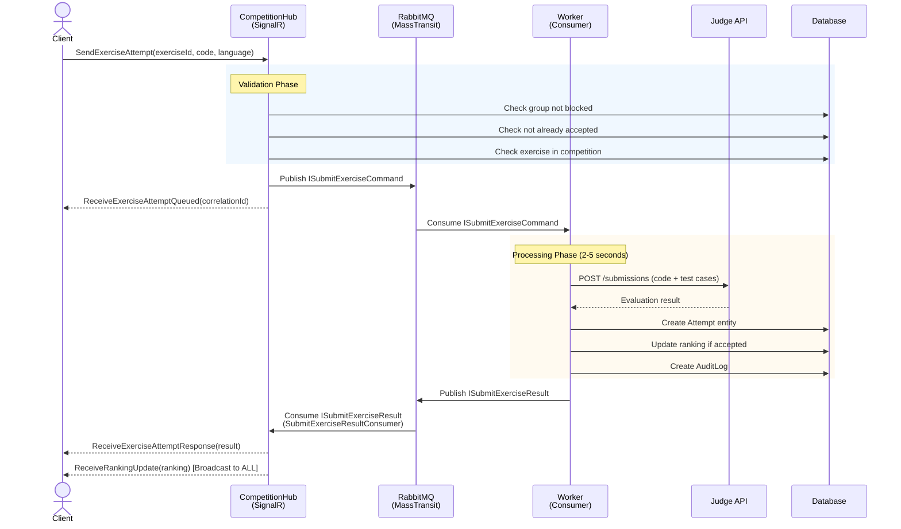
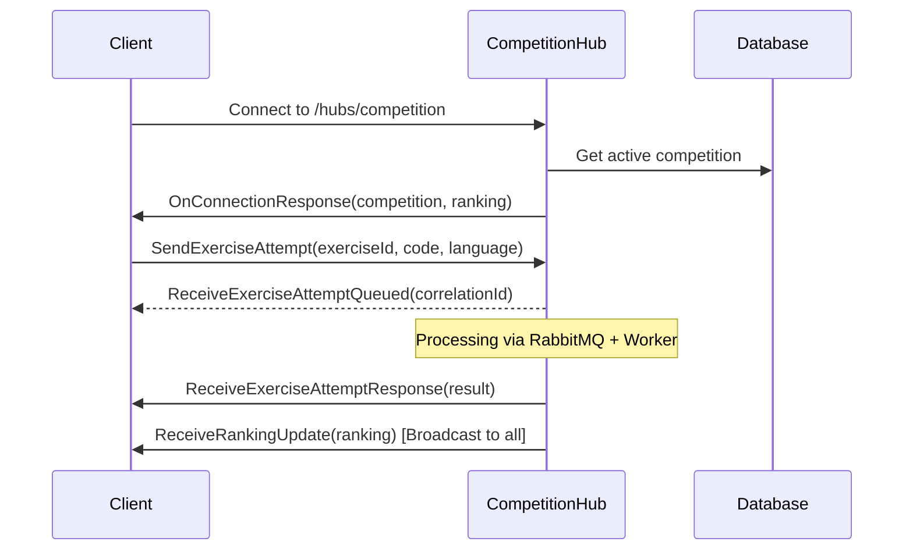

# Falcon API Reborn 🦅

[](https://dotnet.microsoft.com/)
[](LICENSE.txt)
[](docs/SIGNALR_RABBITMQ_ARCHITECTURE.md)

**Falcon API Reborn** is a complete rewrite of the Falcon Competition platform backend, implementing modern software engineering practices with **Clean Architecture**, **Domain-Driven Design**, and **Vertical Slice Architecture**. This system provides robust infrastructure for real-time programming competitions with automatic code evaluation, asynchronous processing, and comprehensive management of users, groups, and exercises.

> 🔄 **Evolution**: This is a ground-up reimplementation of the original [FalconAPI](https://github.com/FalconCompetitions/FalconAPI), redesigned with modern architectural patterns and best practices.

**[🇧🇷 Versão em Português](README.pt-br.md)**

---

## 📋 Table of Contents

- [What's New in Reborn](#-whats-new-in-reborn)
- [Technologies Used](#-technologies-used)
- [Architecture Overview](#-architecture-overview)
- [Project Structure](#-project-structure)
- [Key Features](#-key-features)
- [Getting Started](#-getting-started)
- [API Documentation](#-api-documentation)
- [Real-Time Architecture](#-real-time-architecture)
- [Background Processing](#-background-processing)
- [Testing](#-testing)
- [Configuration](#-configuration)
- [Deployment](#-deployment)
- [License](#-license)

---

## 🚀 What's New in Reborn

### Architectural Improvements

| Aspect | Previous (FalconAPI) | Current (Reborn) |
|--------|---------------------|------------------|
| **Architecture** | Traditional Layered (Controllers → Services → Repositories) | **Clean Architecture** + **Vertical Slices** |
| **Organization** | By technical concern (all controllers together) | **By feature** (self-contained feature folders) |
| **Communication** | Direct service calls | **MediatR** (CQRS pattern) |
| **Messaging** | Background queue with `ConcurrentQueue` | **RabbitMQ** + **MassTransit** |
| **Endpoints** | ASP.NET MVC Controllers | **Minimal APIs** with auto-discovery |
| **Domain Logic** | Anemic domain models | **Rich domain entities** with business rules |
| **Validation** | Manual validation in controllers | **Domain rule validation** + FormException |
| **API Docs** | Swagger UI | **Scalar** (modern, purple theme) |
| **Worker** | Hosted service in same project | **Separate Worker project** |
| **Dependency Direction** | Circular dependencies possible | **Strict inward-only** dependencies |

### Key Benefits

✅ **Better Testability**: Clean separation enables easier unit testing  
✅ **Maintainability**: Features are self-contained and cohesive  
✅ **Scalability**: Worker can be scaled independently  
✅ **Reliability**: RabbitMQ provides guaranteed message delivery  
✅ **Flexibility**: Easy to add new features without touching existing code  
✅ **Domain Focus**: Business rules are explicit and enforced  

---

## 🛠️ Technologies Used

### Core Framework
- **.NET 10** - Latest .NET with C# 13
- **ASP.NET Core** - Web API with Minimal APIs
- **Entity Framework Core 10** - ORM with SQL Server support

### Architecture Patterns
- **Clean Architecture** - Dependency inversion with clear boundaries
- **Vertical Slice Architecture** - Feature-based organization
- **Domain-Driven Design** - Rich domain models with business rules
- **CQRS Pattern** - Command/Query separation via MediatR

### Messaging & Real-Time
- **MassTransit** - Distributed application framework
- **RabbitMQ** - Message broker for reliable async processing
- **SignalR** - WebSocket-based real-time communication

### Authentication & Security
- **ASP.NET Core Identity** - User and role management
- **JWT Bearer Authentication** - Stateless token-based auth
- **Cookie Authentication** - Seamless frontend integration

### Infrastructure
- **SQL Server** - Primary database (production)
- **Docker & Docker Compose** - Containerization
- **Scalar** - Modern API documentation (replaces Swagger)
- **ASP.NET Core Logging** - Built-in structured logging via ILogger

### Development Tools
- **MediatR** - Mediator pattern implementation
- **xUnit** - Testing framework
- **Moq** - Mocking library (used in Core.Tests)

---

## 🏗️ Architecture Overview

### Clean Architecture Layers

```
=================================================================
                        Falcon.Api
          (Presentation Layer - Minimal APIs + SignalR)
  • Endpoints (auto-discovered IEndpoint implementations)
  • SignalR Hubs (CompetitionHub)
  • Global Exception Handler
=================================================================
                            ↓ depends on
=================================================================
                        Falcon.Core
                (Domain Layer - No Dependencies)
  • Domain Entities (User, Group, Competition, Exercise)
  • Business Rules (IBusinessRule implementations)
  • Value Objects & Enums
  • Domain Exceptions (FormException, DomainException)
  • Service Interfaces (ITokenService, IJudgeService)
=================================================================
                            ↓ implemented by
=================================================================
                    Falcon.Infrastructure
            (Infrastructure Layer - External Concerns)
  • EF Core DbContext & Configurations
  • ASP.NET Identity Integration
  • MassTransit Configuration
  • Judge API Client (IJudgeService)
  • File Storage Service
  • Token Service (JWT generation)
=================================================================

                    Falcon.Worker
                (Background Processing)
              • MassTransit Consumers
              • Judge API Integration
              • Database Updates
```

### Vertical Slice Architecture

Each feature is organized in a **self-contained folder** with all related concerns:

```
Features/
  Auth/
    RegisterUser/
      RegisterUserCommand.cs      # MediatR request
      RegisterUserHandler.cs      # Business logic
      RegisterUserEndpoint.cs     # HTTP endpoint
      RegisterUserResult.cs       # Response DTO
    Login/
      LoginCommand.cs
      LoginHandler.cs
      ...
  Competitions/
    CreateCompetition/
    GetCompetitions/
    Hubs/
      CompetitionHub.cs           # SignalR hub
    ...
  ...
```

**Key Architectural Patterns**:

- **CQRS with MediatR**: All business operations use the Command/Query pattern via MediatR `IRequest<TResponse>` and `IRequestHandler<TRequest, TResponse>`
- **Auto-Discovery**: Endpoints implementing `IEndpoint` interface are automatically registered at startup via reflection
- **Feature Isolation**: Each feature folder contains everything needed (command, handler, endpoint, DTOs) - no shared services
- **Domain-Driven Design**: Rich domain entities with explicit business rules validated through `IBusinessRule` implementations
- **Primary Keys**: All entities use `Guid` for primary keys (except `User` which uses `string` due to ASP.NET Identity)

**Feature Creation Pattern**:

1. **Command**: Define request with `IRequest<TResult>` marker
2. **Handler**: Implement `IRequestHandler<TCommand, TResult>` with business logic
3. **Endpoint**: Implement `IEndpoint` with `MapEndpoint(IEndpointRouteBuilder app)` method
4. **Result**: Define response DTO with all necessary data

**Exception Handling**:

- `FormException` → 400 Bad Request (field-level validation errors)
- `BusinessRuleValidationException` → 422 Unprocessable Entity (domain rule violations)
- `NotFoundException` → 404 Not Found (entity not found)
- `DomainException` → 500 Internal Server Error (unexpected domain errors)

### Message Flow Architecture

**Detailed Submission Processing Sequence**:



**Architecture Components**:

1. **CompetitionHub** (SignalR): Handles WebSocket connections, validates submissions, publishes to queue
2. **RabbitMQ** (MassTransit): Message broker ensuring reliable delivery and decoupling
3. **Worker** (Background Service): Consumes messages, calls Judge API, updates database
4. **Judge API** (External): Executes code in sandboxed environment and returns results
5. **SubmitExerciseResultConsumer** (API): Receives results from Worker and notifies clients

**Why This Architecture?**

| Without RabbitMQ (Blocking) | With RabbitMQ (Async) |
|----------------------------|----------------------|
| Client → API → Judge → Response | Client → API → Queue → ✓ |
| Wait time: 2-5 seconds (blocking) | Wait time: ~50ms (immediate) |
| API thread blocked during execution | Worker processes async |
| No retry on Judge API failure | Automatic retry with backoff |
| Can't scale processing independently | Scale workers horizontally |
| Single point of failure | Queue persists if Worker down |

**Key Benefits**:
- ✅ **Scalable**: Workers can be scaled horizontally (run multiple instances)
- ✅ **Reliable**: RabbitMQ guarantees message delivery even if Worker is temporarily down
- ✅ **Resilient**: Failures in Judge API don't crash or block the main API
- ✅ **Fast**: API responds immediately (~50ms), processing happens asynchronously (~2-5s)
- ✅ **Decoupled**: API and Worker can be deployed, updated, and scaled independently
- ✅ **Observable**: Each component can be monitored separately for bottlenecks

See [SIGNALR_RABBITMQ_ARCHITECTURE.md](docs/SIGNALR_RABBITMQ_ARCHITECTURE.md) for complete flow documentation.

---

## 📁 Project Structure

```
FalconApiReborn/
  src/
    Falcon.Api/                           # Presentation Layer
      Features/                           # Vertical Slices
        Admin/
        Auth/
          RegisterUser/
            RegisterUserCommand.cs
            RegisterUserHandler.cs
            RegisterUserEndpoint.cs
            RegisterUserResult.cs
          Login/
          ...
        Competitions/
          Hubs/
            CompetitionHub.cs             # SignalR Hub
          CreateCompetition/
          GetCompetitions/
          ...
        Exercises/
        Groups/
        Submissions/
          Consumers/
            SubmitExerciseResultConsumer.cs
          SubmitAttempt/
        ...
      Extensions/
        IEndpoint.cs                      # Endpoint interface
        EndpointExtensions.cs             # Auto-discovery
      Infrastructure/
        GlobalExceptionHandler.cs         # Exception handling
      Program.cs                          # Entry point
      wwwroot/
        uploads/                          # File storage

    Falcon.Core/                          # Domain Layer
      Domain/
        Users/
          User.cs                         # User entity
        Groups/
          Group.cs                        # Group entity
          Rules/
            GroupCannotHaveMoreThanMaxMembersRule.cs
        Competitions/
        Exercises/
        Shared/
          IBusinessRule.cs
          Exceptions/
            FormException.cs
            BusinessRuleValidationException.cs
            DomainException.cs
      Interfaces/
        ITokenService.cs
        IJudgeService.cs
        IFileStorageService.cs
      Messages/
        ISubmitExerciseCommand.cs
        ISubmitExerciseResult.cs
      Entity.cs                           # Base entity

    Falcon.Infrastructure/                # Infrastructure Layer
      Database/
        FalconDbContext.cs
        Configurations/                   # EF configurations
      Auth/
        TokenService.cs                   # JWT implementation
      Judge/
        JudgeService.cs                   # Judge API client
        Models/
      Storage/
        LocalFileStorageService.cs
      Extensions/
        IdentityExtensions.cs             # Error translation
      Migrations/                         # EF migrations
      DependencyInjection.cs              # Service registration

    Falcon.Worker/                        # Background Processing
      Consumers/
        SubmitExerciseCommandConsumer.cs
      Program.cs
      appsettings.json

  tests/
    Falcon.Api.IntegrationTests/
    Falcon.Core.Tests/

  docs/
    SIGNALR_RABBITMQ_ARCHITECTURE.md      # Architecture docs

  .github/
    copilot-instructions.md               # AI agent instructions

  docker-compose.yml                      # Production compose
  add-migration.ps1                       # Migration helper
  update-db.ps1                           # Database update helper
  FalconApiReborn.sln
```

---

## ✨ Key Features

### 🔐 Authentication & Authorization
- User registration with role selection (Student, Teacher, Admin)
- JWT-based authentication with refresh tokens
- Cookie-based session for frontend integration
- Role-based access control (RBAC)
- Teacher registration requires access code validation

### 👥 User Management
- Complete user CRUD operations
- Profile management
- Group membership tracking
- Activity logging

### 🏆 Competition System
- Competition lifecycle management (Registration → In Progress → Finished)
- Exercise association with competitions
- Real-time ranking calculation
- Group blocking mechanism
- Penalty system for incorrect submissions

### 📝 Exercise Management
- Programming exercise creation with test cases
- Multiple programming language support
- Automatic code evaluation via Judge API
- File attachments (PDFs, images)
- Submission history tracking

### 👨‍👩‍👦 Group System
- Student group formation (max 3 members)
- Invitation system with acceptance/rejection
- Group leader permissions
- Competition registration
- Submission tracking per group

### 💬 Questions & Answers
- **Real-time SignalR methods**: `AskQuestion` and `AnswerQuestion` for instant communication
- **REST API endpoints**: `GET /api/Question` (paginated list with filters) and `GET /api/Question/{id}` (single question details)
- **Question types**: Exercise-specific or general competition questions
- **Answer visibility**: Public answers (visible to all) or private (visible only to asker)
- **Content validation**: Questions limited to 1000 characters, answers to 2000 characters
- **Optimistic concurrency**: `RowVersion` field prevents conflicting answer updates
- **Audit logging**: All question and answer activities tracked with timestamps
- **Filtering capabilities**: Filter questions by competition, exercise, type, and pagination support

### 📊 Logging & Audit
- Comprehensive activity logging
- User action tracking
- Competition event logging
- Submission history

### ⚡ Real-Time Communication
- **SignalR Hub** for live competition updates
- **WebSocket** connection with automatic reconnection
- **Group-based broadcasting** (Admin, Teacher, Student)
- **Real-time events**:
  - Ranking updates
  - Submission notifications
  - Question/Answer notifications
  - Competition state changes

### 🔄 Asynchronous Processing
- **RabbitMQ** message broker for reliable delivery
- **Worker service** for background code evaluation
- **Parallel processing** with configurable concurrency
- **Automatic retry** for transient failures
- **Database updates** with ranking recalculation

---

## 🚀 Getting Started

### Prerequisites

- **.NET 10 SDK**
- **Docker** and **Docker Compose**
- **SQL Server** (or use Docker)
- **RabbitMQ** (included in docker-compose.yml)

### Quick Start with Docker

1. **Clone the repository**:
   ```bash
   git clone https://github.com/rafael135/FalconApiReborn.git
   cd FalconApiReborn
   ```

2. **Start infrastructure**:
   ```bash
   docker-compose up -d
   ```
   
   This starts:
   - RabbitMQ on `localhost:5672` (management UI: `localhost:15672`)
   
   **Note**: SQL Server is **not included** in docker-compose.yml. You need to install it separately or uncomment the SQL Server service in the file.

3. **Configure connection string** in `src/Falcon.Api/appsettings.Development.json`:
   ```json
   {
     "ConnectionStrings": {
       "DefaultConnection": "Server=localhost,1433;Database=falcon-reborn-dev;User ID=sa;Password=YourPassword;TrustServerCertificate=True;"
     }
   }
   ```

4. **Run database migrations**:
   ```powershell
   .\update-db.ps1
   ```

5. **Start the API**:
   ```bash
   dotnet run --project src/Falcon.Api
   ```

6. **Start the Worker**:
   ```bash
   dotnet run --project src/Falcon.Worker
   ```

7. **Access the API**:
   - Scalar Documentation: https://localhost:7155/scalar/v1
   - API Base URL: https://localhost:7155

---

## 🗄️ Database Migrations

### Using PowerShell Scripts (Windows - Recommended)

```powershell
# Create new migration (prompts for name)
.\add-migration.ps1

# Apply migrations to database
.\update-db.ps1
```

### Using Bash Scripts (Linux/Mac)

```bash
# Create new migration (prompts for name)
./add-migration.sh

# Apply migrations to database
./update-db.sh
```

### Manual Migration Commands

```bash
# Create migration
dotnet ef migrations add MigrationName \
  --project src/Falcon.Infrastructure \
  --startup-project src/Falcon.Api

# Apply migrations
dotnet ef database update \
  --project src/Falcon.Infrastructure \
  --startup-project src/Falcon.Api
```

**Why use scripts?** EF Core migrations require correct project paths. Scripts prevent common errors like targeting wrong project or missing startup project configuration.

---

### Local Development without Docker

1. **Install dependencies**:
   - SQL Server 2019+
   - RabbitMQ Server

2. **Configure `appsettings.Development.json`** with your local connection strings

3. **Run migrations**:
   ```bash
   dotnet ef database update --project src/Falcon.Infrastructure --startup-project src/Falcon.Api
   ```

4. **Run both projects**:
   ```bash
   # Terminal 1 - API
   dotnet run --project src/Falcon.Api

   # Terminal 2 - Worker
   dotnet run --project src/Falcon.Worker
   ```

---

## 👨‍💻 Development Workflows

### Running with Helper Scripts

**Windows (PowerShell)**:
```powershell
# Run API with environment selection
.\run.ps1

# Run Worker
cd src\Falcon.Worker
dotnet run
```

**Linux/Mac (Bash)**:
```bash
# Run API with environment selection
./run.linux.sh

# Run Worker
cd src/Falcon.Worker
dotnet run
```

### Testing Workflow

```bash
# Run all tests
dotnet test

# Run specific test project
dotnet test tests/Falcon.Core.Tests

# Run with detailed output
dotnet test --logger "console;verbosity=detailed"

# Run with coverage (requires coverlet)
dotnet test /p:CollectCoverage=true /p:CoverletOutputFormat=opencover
```

### Integration Testing Pattern

Tests use `CustomWebApplicationFactory` with:
- **In-memory database**: Unique database per test class via `IClassFixture`
- **Mocked MassTransit**: All RabbitMQ services removed for isolated testing
- **Test JWT tokens**: Pre-configured with `TestJwtSecretKey`
- **Helper methods**: `CreateStudentAsync()`, `CreateTeacherAsync()`, `CreateAdminAsync()`

**Example Test**:
```csharp
public class MyFeatureTests : TestBase, IClassFixture<CustomWebApplicationFactory>
{
    public MyFeatureTests(CustomWebApplicationFactory factory) : base(factory) { }

    [Fact]
    public async Task Should_CreateGroup_When_ValidRequest()
    {
        // Arrange
        var (user, token) = await CreateStudentAsync();
        HttpClient.DefaultRequestHeaders.Authorization = 
            new AuthenticationHeaderValue("Bearer", token);
        
        // Act
        var response = await HttpClient.PostAsJsonAsync("/api/Group", new 
        { 
            name = "Test Group" 
        });
        
        // Assert
        response.StatusCode.Should().Be(HttpStatusCode.Created);
    }
}
```

---

## 📖 API Documentation

### Scalar API Explorer

The API uses **Scalar** (modern alternative to Swagger) with a purple theme:

- **URL**: https://localhost:7155/scalar/v1
- **Features**:
  - Interactive API testing
  - Request/Response examples
  - Schema documentation
  - Try-it-out functionality
  - Available in **development only**

### Complete API Reference

<details>
<summary><b>🔐 Authentication</b></summary>

| Method | Endpoint | Description | Auth Required |
|--------|----------|-------------|---------------|
| POST | `/api/Auth/register` | Register new user (Student/Teacher) | No |
| POST | `/api/Auth/login` | Authenticate user and receive JWT + cookie | No |

</details>

<details>
<summary><b>🛡️ Admin Operations</b></summary>

| Method | Endpoint | Description | Auth Required |
|--------|----------|-------------|---------------|
| POST | `/api/Admin/teacher-token` | Generate teacher registration token (1 day expiration) | Admin |
| GET | `/api/Admin/teacher-token` | Get current active teacher token | Admin |
| GET | `/api/Admin/stats` | Get system statistics (users, groups, competitions, exercises, submissions) | Admin |
| GET | `/api/Admin/users` | List all users with optional role filtering | Admin |

**Admin Statistics Response:**
```json
{
  "totalUsers": 150,
  "totalStudents": 120,
  "totalTeachers": 25,
  "totalAdmins": 5,
  "totalGroups": 40,
  "competitions": {
    "pending": 5,
    "ongoing": 2,
    "finished": 30
  },
  "exercises": {
    "algorithm": 45,
    "dataStructure": 30,
    "other": 25
  },
  "submissions": {
    "total": 5000,
    "accepted": 3200,
    "acceptanceRate": 64.0
  }
}
```

</details>

<details>
<summary><b>👥 User Management</b></summary>

| Method | Endpoint | Description | Auth Required |
|--------|----------|-------------|---------------|
| GET | `/api/User` | Get current user profile | Yes |
| GET | `/api/User/{id}` | Get user by ID | Yes |
| PUT | `/api/User/{id}` | Update user profile | Yes (own profile or Admin) |

</details>

<details>
<summary><b>👨‍👩‍👦 Groups</b></summary>

| Method | Endpoint | Description | Auth Required |
|--------|----------|-------------|---------------|
| POST | `/api/Group` | Create new group (max 3 members) | Student |
| GET | `/api/Group/{id}` | Get group details with members | Yes |
| PUT | `/api/Group/{id}` | Update group name | Group Leader |
| POST | `/api/Group/{id}/invite` | Invite user to group (by email) | Group Leader |
| POST | `/api/Group/invite/{id}/accept` | Accept group invitation | Student |
| POST | `/api/Group/invite/{id}/reject` | Reject group invitation | Student |
| POST | `/api/Group/{id}/leave` | Leave group | Group Member |
| DELETE | `/api/Group/{id}/member/{userId}` | Remove member from group | Group Leader |

</details>

<details>
<summary><b>🏆 Competitions</b></summary>

| Method | Endpoint | Description | Auth Required |
|--------|----------|-------------|---------------|
| GET | `/api/Competition` | List all competitions | Yes |
| GET | `/api/Competition/{id}` | Get competition details with exercises and ranking | Yes |
| POST | `/api/Competition` | Create competition template | Teacher/Admin |
| POST | `/api/Competition/{id}/promote` | Promote template to active competition | Teacher/Admin |
| POST | `/api/Competition/{id}/start` | Start competition (opens registration) | Teacher/Admin |
| POST | `/api/Competition/{id}/finish` | Finish competition (closes submissions) | Teacher/Admin |
| POST | `/api/Competition/{id}/register` | Register group in competition | Student (Group Leader) |
| POST | `/api/Competition/{id}/unregister` | Unregister group from competition | Student (Group Leader) |
| POST | `/api/Competition/{id}/block` | Block group from competition | Teacher/Admin |
| POST | `/api/Competition/{id}/exercise` | Add exercise to competition | Teacher/Admin |
| DELETE | `/api/Competition/{id}/exercise/{exerciseId}` | Remove exercise from competition | Teacher/Admin |
| GET | `/api/Competition/{id}/ranking` | Get real-time competition ranking | Yes |
| GET | `/api/Competition/{id}/attempts` | Get all submission attempts for competition | Teacher/Admin |

</details>

<details>
<summary><b>📝 Exercises</b></summary>

| Method | Endpoint | Description | Auth Required |
|--------|----------|-------------|---------------|
| GET | `/api/Exercise` | List all exercises | Teacher/Admin |
| GET | `/api/Exercise/{id}` | Get exercise details with test cases | Yes |
| POST | `/api/Exercise` | Create new exercise | Teacher/Admin |
| PUT | `/api/Exercise/{id}` | Update exercise (description, difficulty, type) | Teacher/Admin |
| POST | `/api/Exercise/{id}/testcase` | Add test case to exercise | Teacher/Admin |
| DELETE | `/api/Exercise/{id}/testcase/{testCaseId}` | Remove test case from exercise | Teacher/Admin |

</details>

<details>
<summary><b>💻 Submissions</b></summary>

| Method | Endpoint | Description | Auth Required |
|--------|----------|-------------|---------------|
| POST | `/api/Submission/attempt` | Submit code solution (HTTP fallback) | Student |
| GET | `/api/Submission/attempt/{id}` | Get specific attempt details with judge results | Yes |
| GET | `/api/Submission/group/{groupId}/attempts` | Get all attempts for a group | Yes |

**Note**: Submissions are primarily handled via **SignalR** (`SendExerciseAttempt` method) for real-time processing. HTTP endpoints are fallback options.

</details>

<details>
<summary><b>📁 File Management</b></summary>

| Method | Endpoint | Description | Auth Required |
|--------|----------|-------------|---------------|
| POST | `/api/File/upload` | Upload file attachment (PDF, images) | Teacher/Admin |
| GET | `/api/File/{id}` | Download file by ID | Yes |
| DELETE | `/api/File/{id}` | Delete file | Teacher/Admin (file owner) |

**Supported File Types**: PDF, PNG, JPG, JPEG (max 10MB per file)

</details>

<details>
<summary><b>� Questions & Answers</b></summary>

| Method | Endpoint | Description | Auth Required |
|--------|----------|-------------|---------------|
| GET | `/api/Question` | Get paginated questions with filters | Yes |
| GET | `/api/Question/{id}` | Get specific question with answer | Yes |

**Query Parameters for `/api/Question`**:
- `competitionId` - Filter by competition ID (Guid)
- `exerciseId` - Filter by exercise ID (Guid, optional)
- `questionType` - Filter by type: `0` = General, `1` = Exercise-specific
- `skip` - Number of records to skip (pagination)
- `take` - Number of records to return (max 100)

**Question Response**:
```json
{
  "id": "guid",
  "content": "How do I solve this problem?",
  "questionType": 1,
  "isAnswered": true,
  "createdAt": "2026-01-08T10:30:00Z",
  "user": { "id": "string", "name": "Student Name", "email": "student@example.com" },
  "group": { "id": "guid", "name": "Group Alpha" },
  "exercise": { "id": "guid", "title": "Exercise 1" },
  "answer": {
    "id": "guid",
    "content": "You should approach this by...",
    "isPublic": true,
    "createdAt": "2026-01-08T10:35:00Z",
    "answeredBy": { "id": "string", "name": "Teacher Name" }
  }
}
```

**Content Validations**:
- Question content: 1-1000 characters
- Answer content: 1-2000 characters

**Note**: Question creation and answering are primarily handled via **SignalR** (`AskQuestion` and `AnswerQuestion` methods). REST endpoints are for querying and displaying question history.

</details>

<details>
<summary><b>�📊 Audit Logging</b></summary>

| Method | Endpoint | Description | Auth Required |
|--------|----------|-------------|---------------|
| GET | `/api/Log` | Get system logs with filtering (by type, user, date range) | Teacher/Admin |
| GET | `/api/Log/user/{userId}` | Get all logs for specific user | Teacher/Admin |

**Available Log Types**:
- `UserRegistered`, `UserLogin`, `UserUpdated`
- `GroupCreated`, `GroupUpdated`, `UserInvitedToGroup`, `UserJoinedGroup`, `UserLeftGroup`
- `CompetitionCreated`, `CompetitionStarted`, `CompetitionFinished`
- `ExerciseCreated`, `ExerciseUpdated`, `ExerciseDeleted`
- `SubmissionCreated`

**Query Parameters for `/api/Log`**:
- `logType` - Filter by log type (e.g., "UserLogin")
- `userId` - Filter by user ID
- `startDate` - Filter logs after this date
- `endDate` - Filter logs before this date
- `page` - Page number (pagination)
- `pageSize` - Items per page

</details>

### SignalR Hub - Real-Time Competition

**Hub Endpoint**: `/hubs/competition`

**Authentication**: Required (JWT token via query string `?access_token=YOUR_TOKEN` or cookies)

**Connection Flow**:


#### Client-Invoked Methods

| Method | Parameters | Description | Role Required |
|--------|------------|-------------|---------------|
| `SendExerciseAttempt` | `exerciseId: Guid`<br>`code: string`<br>`language: LanguageType` | Submit code solution for evaluation | Student (in group) |
| `GetCurrentCompetition` | None | Request current competition data on demand | Any authenticated |
| `AskQuestion` | `competitionId: Guid`<br>`exerciseId: Guid?`<br>`content: string`<br>`questionType: int` | Submit question during competition | Student |
| `AnswerQuestion` | `questionId: Guid`<br>`content: string` | Answer a submitted question | Teacher/Admin |
| `Ping` | None | Keep-alive / connection health check | Any authenticated |

#### Server-Sent Events

| Event | Payload | Description | Recipients |
|-------|---------|-------------|------------|
| `OnConnectionResponse` | `{ competition, ranking, exercises }` | Initial data sent on connection | Connected client only |
| `ReceiveExerciseAttemptQueued` | `{ correlationId, message }` | Confirmation that submission is queued | Submitting client only |
| `ReceiveExerciseAttemptResponse` | `{ success, attemptId, accepted, judgeResponse, executionTime, rankOrder }` | Final result of code evaluation | Submitting client only |
| `ReceiveExerciseAttemptError` | `{ error, message }` | Error during submission processing | Submitting client only |
| `ReceiveRankingUpdate` | `{ ranking: [{ id, points, penalty, rankOrder, group, exerciseAttempts: [{ groupId, exerciseId, attempts }] }] }` | Updated ranking with exercise attempt counts after any submission | **All connected clients** |
| `ReceiveQuestionCreation` | `{ question }` | New question submitted | Teachers/Admins in competition |
| `ReceiveAnswer` | `{ questionId, answer }` | Question answered | Student who asked + Teachers/Admins |
| `ReceiveAnswerError` | `{ error }` | Error answering question | Requester only |
| `Pong` | `{ timestamp }` | Response to Ping | Requester only |

See [SIGNALR_RABBITMQ_ARCHITECTURE.md](docs/SIGNALR_RABBITMQ_ARCHITECTURE.md) for complete documentation.

---

## ⚡ Real-Time Architecture

### SignalR + RabbitMQ Flow

The system uses a **decoupled architecture** for submission processing:

1. **Client** sends code via SignalR (`SendExerciseAttempt`)
2. **CompetitionHub** validates and publishes to **RabbitMQ**
3. **Worker** consumes message, calls **Judge API**, updates database
4. **Worker** publishes result back to **RabbitMQ**
5. **API Consumer** receives result and notifies client via **SignalR**
6. **All clients** receive ranking update

**Benefits**:
- ✅ Scalable: Workers can be scaled horizontally
- ✅ Reliable: RabbitMQ guarantees message delivery
- ✅ Resilient: Failures don't crash the API
- ✅ Fast: API responds immediately, processing happens async

### CORS Configuration

SignalR requires specific CORS setup (configured in `Program.cs`):

```csharp
builder.Services.AddCors(options =>
{
    options.AddPolicy("AllowFrontend", policy =>
    {
        policy.WithOrigins("http://localhost:3000", "http://localhost:5173")
            .AllowAnyHeader()
            .AllowAnyMethod()
            .AllowCredentials(); // Required for SignalR
    });
});
```

---

## 🔄 Background Processing

### Worker Architecture

The **Falcon.Worker** project is a separate executable that:
- Runs as a **standalone service**
- Consumes messages from **RabbitMQ**
- Processes code submissions via **Judge API**
- Updates database and ranking
- Publishes results back to API

**Scalability**: Multiple worker instances can run in parallel.

### MassTransit Configuration

**API Side** (`Falcon.Api`):
```csharp
services.AddApiMassTransit(x =>
{
    x.AddConsumer<SubmitExerciseResultConsumer>();
});
```

**Worker Side** (`Falcon.Worker`):
```csharp
services.AddMassTransit(x =>
{
    x.AddConsumer<SubmitExerciseCommandConsumer>();
    x.UsingRabbitMq((context, cfg) => { /* config */ });
});
```

### Message Contracts

Defined in `Falcon.Core/Messages/`:

```csharp
public interface ISubmitExerciseCommand
{
    Guid ExerciseId { get; }
    string Code { get; }
    LanguageType Language { get; }
    string ConnectionId { get; }
    Guid CorrelationId { get; }
}

public interface ISubmitExerciseResult
{
    bool Success { get; }
    Guid? AttemptId { get; }
    bool Accepted { get; }
    string ConnectionId { get; }
    Guid CorrelationId { get; }
}
```

---

## 🧪 Testing

### Unit Tests

```bash
# Run unit tests
dotnet test

# With coverage
dotnet test /p:CollectCoverage=true
```

### Integration Tests

```bash
# Run integration tests (all tests in Falcon.Api.IntegrationTests project)
dotnet test tests/Falcon.Api.IntegrationTests
```

### Test Structure

```
tests/
├── Falcon.Api.IntegrationTests/          # Integration tests with WebApplicationFactory
│   ├── Features/
│   │   └── Auth/
│   │       └── RegisterUserTests.cs
│   ├── TestBase.cs                       # Base class with helper methods
│   └── WebApplicationFactory.cs          # Test server factory
├── Falcon.Core.Tests/                    # Domain logic unit tests
│   └── Domain/
│       └── Groups/
│           └── GroupTests.cs
└── (Future: Falcon.Infrastructure.Tests/)
```

---

## ⚙️ Configuration

### appsettings.json Structure

```json
{
  "ConnectionStrings": {
    "DefaultConnection": "Server=localhost,1433;Database=falcon-reborn;User ID=sa;Password=YourPassword;TrustServerCertificate=True;"
  },
  "Jwt": {
    "SecretKey": "your-secret-key-minimum-32-characters-long!",
    "Issuer": "FalconSystem",
    "Audience": "FalconSystem"
  },
  "JudgeApi": {
    "Url": "https://judge-api.example.com/v0",
    "SecurityKey": "your-judge-api-security-key"
  }
}
```

**Important**: The JWT configuration is **required** for the API to start. The `SecretKey` must be at least 32 characters long.

### Worker Configuration

The Worker project requires its own `appsettings.json` with database and Judge API configuration:

**`src/Falcon.Worker/appsettings.json`:**
```json
{
  "ConnectionStrings": {
    "DefaultConnection": "Server=localhost,1433;Database=falcon-reborn;User ID=sa;Password=YourPassword;TrustServerCertificate=True;"
  },
  "JudgeApi": {
    "Url": "https://judge-api.example.com/v0",
    "SecurityKey": "same-security-key-as-api"
  }
}
```

**Note**: The Worker does **NOT** need JWT configuration, only ConnectionString and JudgeApi settings.

### Judge API Configuration

The Judge API is an external service that executes and evaluates code submissions. It's required for the competition system to work.

**Partner Project**: The Judge API was developed by a partner undergraduate thesis group as part of a collaborative effort. They were responsible for the code execution engine while this project handles the competition management system.

- **Repository**: [tcc_api by GuilhermeZanetti](https://github.com/GuilhermeZanetti/tcc_api)
- **URL**: Configure the base URL of your Judge API instance in `appsettings.json`
- **SecurityKey**: Authentication key for Judge API requests
- **Setup**: Follow the instructions in the Judge API repository to set up your own instance
```

### Environment Variables (Production)

```bash
ConnectionStrings__DefaultConnection=your-sql-connection
Jwt__SecretKey=your-production-jwt-secret-key-min-32-chars
Jwt__Issuer=FalconSystem
Jwt__Audience=FalconSystem
JudgeApi__Url=https://judge-api.production.com
JudgeApi__SecurityKey=your-judge-api-key
```

**Note**: CORS origins are hardcoded in `Program.cs` for `localhost:3000` and `localhost:5173`. For production, update the `AddCors` configuration in code.

---

## 🔧 Troubleshooting

### Common Issues

**RabbitMQ Connection Failed**
```
Solution: Ensure RabbitMQ is running via docker-compose up -d
Check: http://localhost:15672 (guest/guest)
```

**Database Connection Failed**
```
Solution: Verify SQL Server is running and connection string is correct
Check: SQL Server should be on localhost:1433 with credentials from appsettings.json
```

**SignalR CORS Errors**
```
Solution: Ensure frontend URL is listed in CORS configuration (Program.cs)
Default allowed origins: http://localhost:3000, http://localhost:5173
```

**Migration Errors**
```bash
# Always use the provided scripts:
.\add-migration.ps1    # Windows
./add-migration.sh     # Linux/Mac

# If manual migration fails, ensure:
# 1. You're in the project root directory
# 2. Both projects exist: Falcon.Infrastructure (migrations) and Falcon.Api (startup)
```

**Worker Not Processing Submissions**
```
Solution: Ensure both API and Worker are running simultaneously
Check Worker logs for RabbitMQ connection and Judge API errors
```

**Judge API Not Found**
```
Solution: Configure JudgeApi:Url in appsettings.Development.json
Note: Judge API is a separate service and not included in this repository
```

**JWT Configuration Missing**
```
Error: "ArgumentNullException: Jwt:SecretKey" or "IDX10603: The algorithm: 'HS256' requires the SecurityKey.KeySize to be greater than '128' bits."
Solution: Add JWT configuration to appsettings.Development.json:
{
  "Jwt": {
    "SecretKey": "your-secret-key-minimum-32-characters-long!",
    "Issuer": "FalconSystem",
    "Audience": "FalconSystem"
  }
}
Note: SecretKey must be at least 32 characters. The Worker project does NOT need JWT configuration.
```

**Scalar Documentation Not Showing**
```
Issue: Navigating to https://localhost:7155/scalar/v1 shows 404
Solution 1: Ensure ASPNETCORE_ENVIRONMENT=Development
Solution 2: Root path (/) redirects to /scalar/v1, try navigating to root first
Solution 3: Check if OpenAPI services are registered (builder.Services.AddOpenApi())
```

**Integration Tests Database Conflicts**
```
Error: "Database 'TestDb_xxxxx' already exists" or tests interfering with each other
Solution: Each test class gets unique database via IClassFixture<CustomWebApplicationFactory>
Ensure: Test class inherits from TestBase and implements IClassFixture
Pattern: public class MyTests : TestBase, IClassFixture<CustomWebApplicationFactory>
Note: Tests within the same class share the database, but different test classes are isolated.
```

**Worker Can't Connect to Database**
```
Error: "Cannot open database 'falcon-reborn' requested by the login"
Solution: Ensure Worker's appsettings.json has correct ConnectionString
Check: Worker needs same ConnectionString as API project
Path: src/Falcon.Worker/appsettings.Development.json
```

---

## �🚢 Deployment

### Docker Compose (Recommended)

```bash
# Build and start all services
docker-compose up -d

# View logs
docker-compose logs -f

# Stop services
docker-compose down
```

### Azure App Service

1. **Configure environment variables** in Azure Portal
2. **Enable WebSockets** (required for SignalR)
3. **Set Session Affinity** to `On` (ARRAffinity cookie)
4. **Deploy** via GitHub Actions or Azure CLI

---

## 🎓 Learnings & Skills Acquired

This project served as a comprehensive learning experience, covering modern software engineering practices and cloud technologies:

### Architectural Patterns & Design
- **Clean Architecture**: Practical implementation with strict dependency rules and layer separation
- **Domain-Driven Design (DDD)**: Rich domain models, business rules encapsulation, and ubiquitous language
- **Vertical Slice Architecture**: Feature-based organization for better maintainability and team scalability
- **CQRS Pattern**: Command/Query separation using MediatR for clear intent and scalability

### Backend Technologies
- **.NET 10 & C# 13**: Latest language features (primary constructors, collection expressions, file-scoped types)
- **Entity Framework Core 10**: Advanced patterns (configurations, migrations, concurrency control with RowVersion)
- **ASP.NET Core Identity**: Custom user management with role-based authorization
- **Minimal APIs**: Endpoint auto-discovery pattern with `IEndpoint` interface

### Distributed Systems & Messaging
- **RabbitMQ & MassTransit**: Message-driven architecture with guaranteed delivery and retry policies
- **SignalR**: Real-time bidirectional communication with connection management and group broadcasting
- **Worker Services**: Independent background processing with horizontal scalability
- **Asynchronous Patterns**: Task-based async/await, parallel processing, and cancellation tokens

### Database & Persistence
- **SQL Server**: Production-ready configuration with connection resilience
- **EF Core Migrations**: Schema versioning and database evolution strategies
- **Concurrency Control**: Optimistic concurrency with RowVersion timestamps

### DevOps & Deployment
- **Docker & Docker Compose**: Multi-container orchestration for development and production
- **Azure App Service**: Cloud deployment with environment variables and configuration management
- **CI/CD Concepts**: Automated build and deployment pipelines (prepared for GitHub Actions)
- **Configuration Management**: Environment-based settings, secrets management, and connection strings

### Security & Authentication
- **JWT Authentication**: Stateless token-based authentication with refresh token strategy
- **Cookie Authentication**: Seamless frontend integration with HTTP-only cookies
- **CORS Configuration**: Cross-origin resource sharing for SignalR and REST APIs
- **Input Validation**: Domain-level validation with custom exceptions and Problem Details

### Testing & Quality
- **Unit Testing**: xUnit with isolation using Moq for dependency mocking (Core.Tests)
- **Integration Testing**: End-to-end API testing with in-memory databases (Api.IntegrationTests)
- **Exception Handling**: Global exception handler with standardized error responses (RFC 7807 Problem Details)
- **Logging**: Structured logging with ASP.NET Core ILogger for production monitoring

### API Documentation & Developer Experience
- **Scalar**: Modern API documentation with interactive testing (replacement for Swagger)
- **OpenAPI 3.1**: API specification and contract-first design
- **Developer Workflows**: PowerShell scripts for common tasks (migrations, database updates)

### Software Engineering Practices
- **Refactoring**: Complete system redesign from legacy architecture to modern patterns
- **Code Organization**: Feature-based folder structure with clear separation of concerns
- **Dependency Injection**: IoC container configuration and lifetime management
- **Error Handling**: Custom exceptions hierarchy with meaningful error messages in Portuguese

### Problem-Solving Skills
- **Architecture Evolution**: Identifying pain points in original design and implementing solutions
- **Performance Optimization**: Async processing to avoid blocking API requests
- **Scalability Planning**: Designing for horizontal scaling with stateless services
- **Technical Debt Management**: Incremental improvements while maintaining functionality

### Collaboration & Documentation
- **Technical Documentation**: Comprehensive README files in multiple languages
- **Architecture Diagrams**: Visual representation of system flows and component interactions
- **AI-Assisted Development**: Creating instructions for AI coding agents (GitHub Copilot)
- **Code Comments**: XML documentation for public APIs and complex business logic

---

## 📚 Additional Resources

- **[.github/copilot-instructions.md](.github/copilot-instructions.md)** - AI agent development guide
- **[docs/SIGNALR_RABBITMQ_ARCHITECTURE.md](docs/SIGNALR_RABBITMQ_ARCHITECTURE.md)** - Real-time architecture
- **[Scalar API Docs](https://localhost:7163/scalar/v1)** - Interactive API explorer (dev only)
- **[Clean Architecture by Uncle Bob](https://blog.cleancoder.com/uncle-bob/2012/08/13/the-clean-architecture.html)**
- **[Vertical Slice Architecture](https://www.jimmybogard.com/vertical-slice-architecture/)**

---

## 📄 License

This project is licensed under the MIT License - see the [LICENSE.txt](LICENSE.txt) file for details.

---

## 👥 Contributors

**This Project - Backend & Competition Management** (Original & Reborn)
- API architecture and implementation
- Clean Architecture + DDD redesign
- Competition system, groups, and real-time features

**Frontend Development** (Original project)
- React application and user interface

**Partner TCC Group - Judge API** ([Repository](https://github.com/GuilhermeZanetti/tcc_api))
- Code execution engine
- Programming language support
- Security and sandboxing

---

## 🙏 Acknowledgments

- **Partner TCC Group** ([GuilhermeZanetti/tcc_api](https://github.com/GuilhermeZanetti/tcc_api)) for developing the Judge API code execution engine
- **.NET Community** for excellent documentation and libraries
- **Clean Architecture** and **DDD** communities for architectural guidance
- **MassTransit** and **SignalR** teams for powerful frameworks
