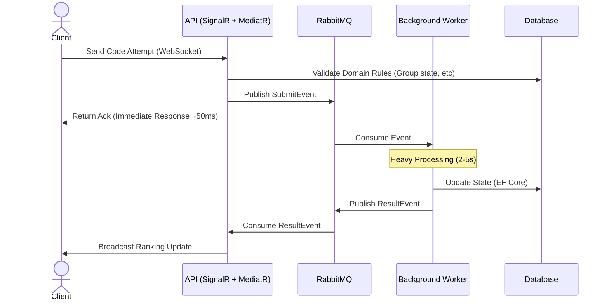

# 🦅 Falcon API Reborn 

[](https://dotnet.microsoft.com/)
[](docs/SIGNALR_RABBITMQ_ARCHITECTURE.md)
[](https://www.rabbitmq.com/)

**Falcon API Reborn** is a complete architectural rewrite of the Falcon Competition backend. Moving away from traditional monolithic layers, this system was rebuilt from the ground up utilizing **Clean Architecture**, **Domain-Driven Design (DDD)**, with API endpoint organization inspired by **Vertical Slice** principles (feature folders). 

It provides a highly resilient, distributed infrastructure for real-time programming competitions, featuring asynchronous code evaluation, WebSocket broadcasting, and strict domain validation.

> 🔄 **The Evolution**: This is a major engineering upgrade from the original legacy API, focused on decoupling business logic from framework details and solving real-time concurrency bottlenecks.

---

## 🏗️ Architectural Evolution & ROI

To understand the engineering impact of this rewrite, here is the architectural paradigm shift:

| Aspect | Legacy Architecture | Reborn Architecture | Engineering Impact |
|---------|----------------------|----------------|---------------------|
| **Core Design** | Traditional N-Tier (Controllers → Services) | **Clean Architecture + DDD** | Business rules are strictly isolated from framework dependencies. |
| **Organization** | By technical concern | **Feature-organized endpoints (Vertical Slice-inspired)** | Features are highly cohesive, making the codebase scalable across multiple teams. |
| **State Mutation** | Direct Service Calls | **CQRS via MediatR** | Strict separation of read/write operations, improving maintainability. |
| **Processing** | In-memory `ConcurrentQueue` | **RabbitMQ + MassTransit** | Solved memory leaks and guaranteed message delivery under high load. |
| **Real-time** | Polling | **SignalR WebSockets** | Reduced database load by broadcasting state changes instantly. |

---

## ⚙️ Core Engineering Highlights

### 1. Domain-Driven Design (DDD) strictly applied
The domain layer has **zero dependencies**. All business rules are enforced via `IBusinessRule` implementations, ensuring that entities like `User`, `Group`, and `Competition` are always in a valid state. 

### 2. Distributed Processing (The Messaging Pipeline)
A major challenge was preventing the API from blocking while external services evaluated the submitted code. 

**The Solution:**
* The API acts only as a gateway, pushing `ISubmitExerciseCommand` to a **RabbitMQ** exchange.
* An independent, highly scalable **Worker Service** consumes the queue, handles the heavy lifting (Judge API integration), and updates the database.
* The Worker publishes an `ISubmitExerciseResult` event, which is caught by the API and broadcasted to clients via **SignalR**.


```mermaid
sequenceDiagram
    actor Client
    participant API as API (SignalR + MediatR)
    participant RMQ as RabbitMQ
    participant Worker as Background Worker
    participant DB as Database

    Client->>API: Send Code Attempt (WebSocket)
    API->>DB: Validate Domain Rules (Group state, etc)
    API->>RMQ: Publish SubmitEvent
    API-->>Client: Return Ack (Immediate Response ~50ms)
    
    RMQ->>Worker: Consume Event
    Note over Worker: Heavy Processing (2-5s)
    Worker->>DB: Update State (EF Core)
    Worker->>RMQ: Publish ResultEvent
    
    RMQ->>API: Consume ResultEvent
    API->>Client: Broadcast Ranking Update
```

### 3. API Feature Organization (Vertical Slice-inspired)
Instead of scattering related code across different technical folders, every feature is completely self-contained. Adding a new feature means creating a new folder, not touching existing core files.

```text
Features/
  Competitions/
    SubmitAttempt/
      SubmitAttemptCommand.cs      # CQRS Request
      SubmitAttemptHandler.cs      # Business Logic
      SubmitAttemptEndpoint.cs     # Minimal API Endpoint
```

---

## 🛠️ Tech Stack Overview

* **Framework:** .NET 10, ASP.NET Core Minimal APIs
* **Architecture:** Clean Architecture, DDD, CQRS (MediatR), with feature-based API endpoint organization inspired by Vertical Slices
* **Data & Persistence:** Entity Framework Core 10, SQL Server
* **Messaging & Async:** RabbitMQ, MassTransit, Quartz.NET
* **Real-Time:** SignalR
* **Quality Assurance:** xUnit, Moq (TDD approach for Domain logic)
* **DevOps:** Docker, Docker Compose, Azure App Service readiness

---

## 🚀 Getting Started

To run this architecture locally, ensure you have **Docker** and **.NET 10 SDK** installed.

1. **Clone & Spin up the infrastructure (RabbitMQ):**
   ```bash
   docker-compose up -d
   ```
2. **Apply Database Migrations:**
   ```bash
   ./update-db.sh  # or .\update-db.ps1 on Windows
   ```
3. **Run the Distributed System:**
   ```bash
   # Terminal 1 - The API Gateway
   dotnet run --project src/Falcon.Api

   # Terminal 2 - The Background Processor
   dotnet run --project src/Falcon.Worker
   ```

> 📖 **Full API Documentation:** Once running, navigate to `https://localhost:7155/scalar/v1` for the interactive OpenAPI documentation powered by Scalar.

---

## 📄 License
This project is licensed under the MIT License - see the [LICENSE.txt](LICENSE.txt) file for details.
