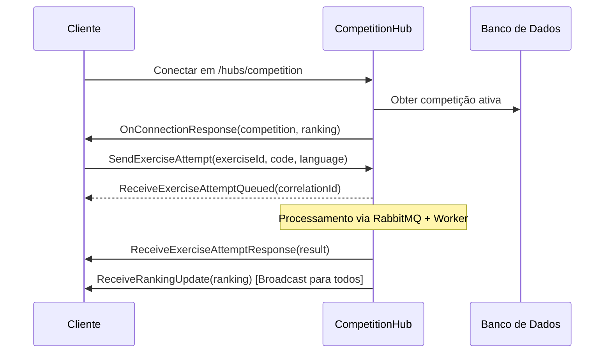
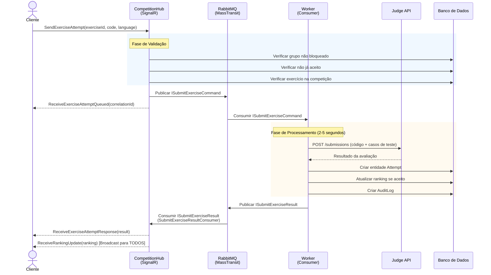

# Falcon API Reborn 🦅

[](https://dotnet.microsoft.com/)
[](LICENSE.txt)
[](docs/SIGNALR_RABBITMQ_ARCHITECTURE.md)

**Falcon API Reborn** é uma reescrita completa do backend da plataforma Falcon Competition, implementando práticas modernas de engenharia de software com **Clean Architecture**, **Domain-Driven Design** e **Vertical Slice Architecture**. Este sistema fornece infraestrutura robusta para competições de programação em tempo real com avaliação automática de código, processamento assíncrono e gerenciamento abrangente de usuários, grupos e exercícios.

> 🔄 **Evolução**: Esta é uma reimplementação completa da [FalconAPI](https://github.com/FalconCompetitions/FalconAPI) original, redesenhada com padrões arquiteturais modernos e melhores práticas.

**[🇺🇸 English Version](README.md)**

---

## 📋 Índice

- [Novidades do Reborn](#-novidades-do-reborn)
- [Tecnologias Utilizadas](#-tecnologias-utilizadas)
- [Visão Geral da Arquitetura](#-visão-geral-da-arquitetura)
- [Estrutura do Projeto](#-estrutura-do-projeto)
- [Funcionalidades Principais](#-funcionalidades-principais)
- [Primeiros Passos](#-primeiros-passos)
- [Documentação da API](#-documentação-da-api)
- [Arquitetura em Tempo Real](#-arquitetura-em-tempo-real)
- [Processamento em Background](#-processamento-em-background)
- [Testes](#-testes)
- [Configuração](#-configuração)
- [Deploy](#-deploy)
- [Licença](#-licença)

---

## 🚀 Novidades do Reborn

### Melhorias Arquiteturais

| Aspecto | Anterior (FalconAPI) | Atual (Reborn) |
|---------|----------------------|----------------|
| **Arquitetura** | Camadas Tradicionais (Controllers → Services → Repositories) | **Clean Architecture** + **Vertical Slices** |
| **Organização** | Por preocupação técnica (todos os controllers juntos) | **Por feature** (pastas de features auto-contidas) |
| **Comunicação** | Chamadas diretas de serviço | **MediatR** (padrão CQRS) |
| **Mensageria** | Fila em background com `ConcurrentQueue` | **RabbitMQ** + **MassTransit** |
| **Endpoints** | Controllers ASP.NET MVC | **Minimal APIs** com auto-descoberta |
| **Lógica de Domínio** | Modelos de domínio anêmicos | **Entidades ricas** com regras de negócio |
| **Validação** | Validação manual nos controllers | **Validação de regras de domínio** + FormException |
| **Docs da API** | Swagger UI | **Scalar** (moderno, tema roxo) |
| **Worker** | Hosted service no mesmo projeto | **Projeto Worker separado** |
| **Direção de Dependências** | Dependências circulares possíveis | Dependências **estritamente para dentro** |

### Principais Benefícios

✅ **Melhor Testabilidade**: Separação limpa permite testes unitários mais fáceis  
✅ **Manutenibilidade**: Features são auto-contidas e coesas  
✅ **Escalabilidade**: Worker pode ser escalado independentemente  
✅ **Confiabilidade**: RabbitMQ garante entrega de mensagens  
✅ **Flexibilidade**: Fácil adicionar novas features sem tocar em código existente  
✅ **Foco no Domínio**: Regras de negócio são explícitas e aplicadas  

---

## 🛠️ Tecnologias Utilizadas

### Framework Principal
- **.NET 10** - Última versão do .NET com C# 13
- **ASP.NET Core** - Web API com Minimal APIs
- **Entity Framework Core 10** - ORM com suporte a SQL Server

### Padrões Arquiteturais
- **Clean Architecture** - Inversão de dependências com limites claros
- **Vertical Slice Architecture** - Organização baseada em features
- **Domain-Driven Design** - Modelos de domínio ricos com regras de negócio
- **Padrão CQRS** - Separação Command/Query via MediatR

### Mensageria e Tempo Real
- **MassTransit** - Framework para aplicações distribuídas
- **RabbitMQ** - Message broker para processamento assíncrono confiável
- **SignalR** - Comunicação em tempo real baseada em WebSocket

### Autenticação e Segurança
- **ASP.NET Core Identity** - Gerenciamento de usuários e roles
- **JWT Bearer Authentication** - Autenticação stateless baseada em token
- **Cookie Authentication** - Integração perfeita com frontend

### Infraestrutura
- **SQL Server** - Banco de dados principal (produção)
- **Docker & Docker Compose** - Containerização
- **Scalar** - Documentação moderna da API (substitui Swagger)
- **ASP.NET Core Logging** - Logging estruturado integrado via ILogger

### Ferramentas de Desenvolvimento
- **MediatR** - Implementação do padrão Mediator
- **xUnit** - Framework de testes
- **Moq** - Biblioteca de mocking (usada em Core.Tests)

---

## 🏗️ Visão Geral da Arquitetura

### Camadas da Clean Architecture

```
=================================================================
                        Falcon.Api
        (Camada de Apresentação - Minimal APIs + SignalR)
  • Endpoints (implementações IEndpoint auto-descobertas)
  • SignalR Hubs (CompetitionHub)
  • Global Exception Handler
=================================================================
                            ↓ depende de
=================================================================
                        Falcon.Core
              (Camada de Domínio - Sem Dependências)
  • Entidades de Domínio (User, Group, Competition, Exercise)
  • Regras de Negócio (implementações IBusinessRule)
  • Value Objects & Enums
  • Exceções de Domínio (FormException, DomainException)
  • Interfaces de Serviço (ITokenService, IJudgeService)
=================================================================
                            ↓ implementado por
=================================================================
                    Falcon.Infrastructure
          (Camada de Infraestrutura - Preocupações Externas)
  • EF Core DbContext & Configurações
  • Integração com ASP.NET Identity
  • Configuração do MassTransit
  • Cliente Judge API (IJudgeService)
  • Serviço de Armazenamento de Arquivos
  • Token Service (geração JWT)
=================================================================

                    Falcon.Worker
                (Processamento Background)
              • Consumers MassTransit
              • Integração Judge API
              • Atualizações no Banco
```

### Vertical Slice Architecture

Cada feature é organizada em uma **pasta auto-contida** com todas as preocupações relacionadas:

```
Features/
  Auth/
    RegisterUser/
      RegisterUserCommand.cs      # Request MediatR
      RegisterUserHandler.cs      # Lógica de negócio
      RegisterUserEndpoint.cs     # Endpoint HTTP
      RegisterUserResult.cs       # DTO de resposta
    Login/
      LoginCommand.cs
      LoginHandler.cs
      ...
  Competitions/
    CreateCompetition/
    GetCompetitions/
    Hubs/
      CompetitionHub.cs           # Hub SignalR
    ...
  ...
```

### Arquitetura de Fluxo de Mensagens

```
┌─────────┐         ┌──────────────┐         ┌──────────┐         ┌─────────┐
│ Cliente │         │ CompetitionHub│         │ RabbitMQ │         │ Worker  │
│ (React) │         │  (SignalR)    │         │(MassT.)  │         │Consumer │
└────┬────┘         └──────┬───────┘         └─────┬────┘         └────┬────┘
     │                     │                        │                   │
     │ SendExerciseAttempt │                        │                   │
     ├────────────────────►│                        │                   │
     │                     │ Valida & Publica       │                   │
     │                     ├───────────────────────►│                   │
     │                     │                        │ Consome Mensagem  │
     │                     │                        ├──────────────────►│
     │                     │                        │                   │ Processa
     │                     │                        │                   │ - Chama Judge
     │                     │                        │                   │ - Atualiza BD
     │                     │                        │                   │ - Calcula Ranking
     │                     │                        │                   │
     │                     │                        │ Publica Resultado │
     │                     │◄───────────────────────┤◄──────────────────┤
     │                     │ (SubmitExerciseResult  │                   │
     │                     │  Consumer na API)      │                   │
     │                     │                        │                   │
     │ ReceiveAttemptResponse                       │                   │
     │◄────────────────────┤                        │                   │
     │                     │                        │                   │
     │ ReceiveRankingUpdate (TODOS OS CLIENTES)     │                   │
     │◄────────────────────┤                        │                   │
```

Veja [SIGNALR_RABBITMQ_ARCHITECTURE.md](docs/SIGNALR_RABBITMQ_ARCHITECTURE.md) para documentação completa do fluxo.

---

## 📁 Estrutura do Projeto

```
FalconApiReborn/
  src/
    Falcon.Api/                           # Camada de Apresentação
      Features/                           # Vertical Slices
        Admin/
        Auth/
          RegisterUser/
            RegisterUserCommand.cs
            RegisterUserHandler.cs
            RegisterUserEndpoint.cs
            RegisterUserResult.cs
          Login/
          ...
        Competitions/
          Hubs/
            CompetitionHub.cs             # Hub SignalR
          CreateCompetition/
          GetCompetitions/
          ...
        Exercises/
        Groups/
        Submissions/
          Consumers/
            SubmitExerciseResultConsumer.cs
          SubmitAttempt/
        ...
      Extensions/
        IEndpoint.cs                      # Interface de endpoint
        EndpointExtensions.cs             # Auto-descoberta
      Infrastructure/
        GlobalExceptionHandler.cs         # Tratamento de exceções
      Program.cs                          # Ponto de entrada
      wwwroot/
        uploads/                          # Armazenamento de arquivos

    Falcon.Core/                          # Camada de Domínio
      Domain/
        Users/
          User.cs                         # Entidade User
        Groups/
          Group.cs                        # Entidade Group
          Rules/
            GroupCannotHaveMoreThanMaxMembersRule.cs
        Competitions/
        Exercises/
        Shared/
          IBusinessRule.cs
          Exceptions/
            FormException.cs
            BusinessRuleValidationException.cs
            DomainException.cs
      Interfaces/
        ITokenService.cs
        IJudgeService.cs
        IFileStorageService.cs
      Messages/
        ISubmitExerciseCommand.cs
        ISubmitExerciseResult.cs
      Entity.cs                           # Entidade base

    Falcon.Infrastructure/                # Camada de Infraestrutura
      Database/
        FalconDbContext.cs
        Configurations/                   # Configurações EF
      Auth/
        TokenService.cs                   # Implementação JWT
      Judge/
        JudgeService.cs                   # Cliente Judge API
        Models/
      Storage/
        LocalFileStorageService.cs
      Extensions/
        IdentityExtensions.cs             # Tradução de erros
      Migrations/                         # Migrations EF
      DependencyInjection.cs              # Registro de serviços

    Falcon.Worker/                        # Processamento Background
      Consumers/
        SubmitExerciseCommandConsumer.cs
      Program.cs
      appsettings.json

  tests/
    Falcon.Api.IntegrationTests/
    Falcon.Core.Tests/

  docs/
    SIGNALR_RABBITMQ_ARCHITECTURE.md      # Docs de arquitetura

  .github/
    copilot-instructions.md               # Instruções para agentes IA

  docker-compose.yml                      # Compose de produção
  add-migration.ps1                       # Helper de migration
  update-db.ps1                           # Helper de atualização BD
  FalconApiReborn.sln
```

---

## ✨ Funcionalidades Principais

### 🔐 Autenticação e Autorização
- Registro de usuário com seleção de role (Aluno, Professor, Admin)
- Autenticação baseada em JWT com refresh tokens
- Sessão baseada em cookies para integração com frontend
- Controle de acesso baseado em roles (RBAC)
- Registro de professor requer validação de código de acesso

### 👥 Gerenciamento de Usuários
- Operações CRUD completas de usuários
- Gerenciamento de perfil
- Rastreamento de membros de grupo
- Log de atividades

### 🏆 Sistema de Competições
- Gerenciamento do ciclo de vida da competição (Registro → Em Andamento → Finalizada)
- Associação de exercícios com competições
- Cálculo de ranking em tempo real
- Mecanismo de bloqueio de grupos
- Sistema de penalidades para submissões incorretas

### 📝 Gerenciamento de Exercícios
- Criação de exercícios de programação com casos de teste
- Suporte a múltiplas linguagens de programação
- Avaliação automática de código via Judge API
- Anexos de arquivos (PDFs, imagens)
- Rastreamento de histórico de submissões

### 👨‍👩‍👦 Sistema de Grupos
- Formação de grupos de alunos (máximo 3 membros)
- Sistema de convites com aceitação/rejeição
- Permissões de líder de grupo
- Registro em competições
- Rastreamento de submissões por grupo

### 💬 Perguntas e Respostas
- Submissão de perguntas em tempo real durante competições
- Sistema de resposta de Professor/Admin
- Respostas públicas ou privadas
- Perguntas específicas de exercício ou gerais

### 📊 Logging e Auditoria
- Log abrangente de atividades
- Rastreamento de ações de usuário
- Log de eventos de competição
- Histórico de submissões

### ⚡ Comunicação em Tempo Real
- **Hub SignalR** para atualizações ao vivo de competições
- Conexão **WebSocket** com reconexão automática
- **Broadcasting baseado em grupos** (Admin, Professor, Aluno)
- **Eventos em tempo real**:
  - Atualizações de ranking
  - Notificações de submissão
  - Notificações de Pergunta/Resposta
  - Mudanças de estado da competição

### 🔄 Processamento Assíncrono
- Message broker **RabbitMQ** para entrega confiável
- **Worker service** para avaliação de código em background
- **Processamento paralelo** com concorrência configurável
- **Retry automático** para falhas transitórias
- **Atualizações de banco de dados** com recálculo de ranking

---

## 🚀 Primeiros Passos

### Pré-requisitos

- **.NET 10 SDK**
- **Docker** e **Docker Compose**
- **SQL Server** (ou usar Docker)
- **RabbitMQ** (incluído no docker-compose.yml)

### Início Rápido com Docker

1. **Clone o repositório**:
   ```bash
   git clone https://github.com/rafael135/FalconApiReborn.git
   cd FalconApiReborn
   ```

2. **Inicie a infraestrutura**:
   ```bash
   docker-compose up -d
   ```
   
   Isso inicia:
   - RabbitMQ em `localhost:5672` (UI de gerenciamento: `localhost:15672`)
   
   **Nota**: SQL Server **não está incluído** no docker-compose.yml. Você precisa instalá-lo separadamente ou descomentar o serviço SQL Server no arquivo.

3. **Configure a connection string** em `src/Falcon.Api/appsettings.Development.json`:
   ```json
   {
     "ConnectionStrings": {
       "DefaultConnection": "Server=localhost,1433;Database=falcon-reborn-dev;User ID=sa;Password=SuaSenha;TrustServerCertificate=True;"
     }
   }
   ```

4. **Execute as migrations do banco**:
   ```powershell
   .\update-db.ps1
   ```

5. **Inicie a API**:
   ```bash
   dotnet run --project src/Falcon.Api
   ```

6. **Inicie o Worker**:
   ```bash
   dotnet run --project src/Falcon.Worker
   ```

7. **Acesse a API**:
   - Documentação Scalar: https://localhost:7155/scalar/v1
   - URL Base da API: https://localhost:7155

---

## 🗄️ Migrations de Banco de Dados

### Usando Scripts PowerShell (Windows - Recomendado)

```powershell
# Criar nova migration (solicita o nome)
.\add-migration.ps1

# Aplicar migrations ao banco de dados
.\update-db.ps1
```

### Usando Scripts Bash (Linux/Mac)

```bash
# Criar nova migration (solicita o nome)
./add-migration.sh

# Aplicar migrations ao banco de dados
./update-db.sh
```

### Comandos Manuais de Migration

```bash
# Criar migration
dotnet ef migrations add NomeDaMigration \
  --project src/Falcon.Infrastructure \
  --startup-project src/Falcon.Api

# Aplicar migrations
dotnet ef database update \
  --project src/Falcon.Infrastructure \
  --startup-project src/Falcon.Api
```

**Por que usar scripts?** As migrations do EF Core requerem caminhos de projeto corretos. Os scripts previnem erros comuns como mirar no projeto errado ou configuração de projeto de inicialização ausente.

---

### Desenvolvimento Local sem Docker

1. **Instale as dependências**:
   - SQL Server 2019+
   - Servidor RabbitMQ

2. **Configure `appsettings.Development.json`** com suas connection strings locais

3. **Execute as migrations**:
   ```bash
   dotnet ef database update --project src/Falcon.Infrastructure --startup-project src/Falcon.Api
   ```

4. **Execute ambos os projetos**:
   ```bash
   # Terminal 1 - API
   dotnet run --project src/Falcon.Api

   # Terminal 2 - Worker
   dotnet run --project src/Falcon.Worker
   ```

---

## 🛠️ Fluxos de Desenvolvimento

### Executando com Scripts Auxiliares

**Windows (PowerShell)**:
```powershell
# Executar API com seleção de ambiente
.\run.ps1

# Executar Worker
cd src\Falcon.Worker
dotnet run
```

**Linux/Mac (Bash)**:
```bash
# Executar API com seleção de ambiente
./run.linux.sh

# Executar Worker
cd src/Falcon.Worker
dotnet run
```

### Fluxo de Testes

```bash
# Executar todos os testes
dotnet test

# Executar projeto de teste específico
dotnet test tests/Falcon.Core.Tests

# Executar com saída detalhada
dotnet test --logger "console;verbosity=detailed"

# Executar com cobertura (requer coverlet)
dotnet test /p:CollectCoverage=true /p:CoverletOutputFormat=opencover
```

### Padrão de Testes de Integração

Os testes usam `CustomWebApplicationFactory` com:
- **Banco de dados em memória**: Banco de dados único por classe de teste via `IClassFixture`
- **MassTransit mockado**: Todos os serviços RabbitMQ removidos para testes isolados
- **Tokens JWT de teste**: Pré-configurados com `TestJwtSecretKey`
- **Métodos auxiliares**: `CreateStudentAsync()`, `CreateTeacherAsync()`, `CreateAdminAsync()`

**Exemplo de Teste**:
```csharp
public class MyFeatureTests : TestBase, IClassFixture<CustomWebApplicationFactory>
{
    public MyFeatureTests(CustomWebApplicationFactory factory) : base(factory) { }

    [Fact]
    public async Task Should_CreateGroup_When_ValidRequest()
    {
        // Arrange
        var (user, token) = await CreateStudentAsync();
        HttpClient.DefaultRequestHeaders.Authorization = 
            new AuthenticationHeaderValue("Bearer", token);
        
        // Act
        var response = await HttpClient.PostAsJsonAsync("/api/Group", new 
        { 
            name = "Grupo Teste" 
        });
        
        // Assert
        response.StatusCode.Should().Be(HttpStatusCode.Created);
    }
}
```

---

## 📖 Documentação da API

### Scalar API Explorer

A API usa **Scalar** (alternativa moderna ao Swagger) com tema roxo:

- **URL**: https://localhost:7155/scalar/v1
- **Funcionalidades**:
  - Teste interativo da API
  - Exemplos de Request/Response
  - Documentação de schemas
  - Funcionalidade try-it-out
  - Disponível apenas em **desenvolvimento**

### Referência Completa da API

<details>
<summary><b>🔐 Autenticação</b></summary>

| Método | Endpoint | Descrição | Auth Necessária |
|--------|----------|-----------|-----------------|
| POST | `/api/Auth/register` | Registrar novo usuário (Aluno/Professor) | Não |
| POST | `/api/Auth/login` | Autenticar usuário e receber JWT + cookie | Não |

</details>

<details>
<summary><b>🛡️ Operações de Administrador</b></summary>

| Método | Endpoint | Descrição | Auth Necessária |
|--------|----------|-----------|-----------------|
| POST | `/api/Admin/teacher-token` | Gerar token de registro de professor (expiração de 1 dia) | Admin |
| GET | `/api/Admin/teacher-token` | Obter token de professor ativo atual | Admin |
| GET | `/api/Admin/stats` | Obter estatísticas do sistema (usuários, grupos, competições, exercícios, submissões) | Admin |
| GET | `/api/Admin/users` | Listar todos os usuários com filtro opcional por role | Admin |

**Resposta de Estatísticas Admin:**
```json
{
  "totalUsers": 150,
  "totalStudents": 120,
  "totalTeachers": 25,
  "totalAdmins": 5,
  "totalGroups": 40,
  "competitions": {
    "pending": 5,
    "ongoing": 2,
    "finished": 30
  },
  "exercises": {
    "algorithm": 45,
    "dataStructure": 30,
    "other": 25
  },
  "submissions": {
    "total": 5000,
    "accepted": 3200,
    "acceptanceRate": 64.0
  }
}
```

</details>

<details>
<summary><b>👥 Gerenciamento de Usuários</b></summary>

| Método | Endpoint | Descrição | Auth Necessária |
|--------|----------|-----------|-----------------|
| GET | `/api/User` | Obter perfil do usuário atual | Sim |
| GET | `/api/User/{id}` | Obter usuário por ID | Sim |
| PUT | `/api/User/{id}` | Atualizar perfil do usuário | Sim (próprio perfil ou Admin) |

</details>

<details>
<summary><b>👨‍👩‍👦 Grupos</b></summary>

| Método | Endpoint | Descrição | Auth Necessária |
|--------|----------|-----------|-----------------|
| POST | `/api/Group` | Criar novo grupo (máx 3 membros) | Aluno |
| GET | `/api/Group/{id}` | Obter detalhes do grupo com membros | Sim |
| PUT | `/api/Group/{id}` | Atualizar nome do grupo | Líder do Grupo |
| POST | `/api/Group/{id}/invite` | Convidar usuário para o grupo (por email) | Líder do Grupo |
| POST | `/api/Group/invite/{id}/accept` | Aceitar convite do grupo | Aluno |
| POST | `/api/Group/invite/{id}/reject` | Rejeitar convite do grupo | Aluno |
| POST | `/api/Group/{id}/leave` | Sair do grupo | Membro do Grupo |
| DELETE | `/api/Group/{id}/member/{userId}` | Remover membro do grupo | Líder do Grupo |

</details>

<details>
<summary><b>🏆 Competições</b></summary>

| Método | Endpoint | Descrição | Auth Necessária |
|--------|----------|-----------|-----------------|
| GET | `/api/Competition` | Listar todas as competições | Sim |
| GET | `/api/Competition/{id}` | Obter detalhes da competição com exercícios e ranking | Sim |
| POST | `/api/Competition` | Criar template de competição | Professor/Admin |
| POST | `/api/Competition/{id}/promote` | Promover template para competição ativa | Professor/Admin |
| POST | `/api/Competition/{id}/start` | Iniciar competição (abre inscrições) | Professor/Admin |
| POST | `/api/Competition/{id}/finish` | Finalizar competição (fecha submissões) | Professor/Admin |
| POST | `/api/Competition/{id}/register` | Registrar grupo na competição | Aluno (Líder do Grupo) |
| POST | `/api/Competition/{id}/unregister` | Cancelar inscrição do grupo | Aluno (Líder do Grupo) |
| POST | `/api/Competition/{id}/block` | Bloquear grupo da competição | Professor/Admin |
| POST | `/api/Competition/{id}/exercise` | Adicionar exercício à competição | Professor/Admin |
| DELETE | `/api/Competition/{id}/exercise/{exerciseId}` | Remover exercício da competição | Professor/Admin |
| GET | `/api/Competition/{id}/ranking` | Obter ranking em tempo real da competição | Sim |
| GET | `/api/Competition/{id}/attempts` | Obter todas as tentativas de submissão da competição | Professor/Admin |

</details>

<details>
<summary><b>📝 Exercícios</b></summary>

| Método | Endpoint | Descrição | Auth Necessária |
|--------|----------|-----------|-----------------|
| GET | `/api/Exercise` | Listar todos os exercícios | Professor/Admin |
| GET | `/api/Exercise/{id}` | Obter detalhes do exercício com casos de teste | Sim |
| POST | `/api/Exercise` | Criar novo exercício | Professor/Admin |
| PUT | `/api/Exercise/{id}` | Atualizar exercício (descrição, dificuldade, tipo) | Professor/Admin |
| POST | `/api/Exercise/{id}/testcase` | Adicionar caso de teste ao exercício | Professor/Admin |
| DELETE | `/api/Exercise/{id}/testcase/{testCaseId}` | Remover caso de teste do exercício | Professor/Admin |

</details>

<details>
<summary><b>💻 Submissões</b></summary>

| Método | Endpoint | Descrição | Auth Necessária |
|--------|----------|-----------|-----------------|
| POST | `/api/Submission/attempt` | Submeter solução de código (fallback HTTP) | Aluno |
| GET | `/api/Submission/attempt/{id}` | Obter detalhes da tentativa específica com resultados do judge | Sim |
| GET | `/api/Submission/group/{groupId}/attempts` | Obter todas as tentativas de um grupo | Sim |

**Nota**: Submissões são principalmente tratadas via **SignalR** (método `SendExerciseAttempt`) para processamento em tempo real. Endpoints HTTP são opções de fallback.

</details>

<details>
<summary><b>📁 Gerenciamento de Arquivos</b></summary>

| Método | Endpoint | Descrição | Auth Necessária |
|--------|----------|-----------|-----------------|
| POST | `/api/File/upload` | Upload de arquivo anexo (PDF, imagens) | Professor/Admin |
| GET | `/api/File/{id}` | Download de arquivo por ID | Sim |
| DELETE | `/api/File/{id}` | Deletar arquivo | Professor/Admin (dono do arquivo) |

**Tipos de Arquivo Suportados**: PDF, PNG, JPG, JPEG (máx 10MB por arquivo)

</details>

<details>
<summary><b>📊 Logs de Auditoria</b></summary>

| Método | Endpoint | Descrição | Auth Necessária |
|--------|----------|-----------|-----------------|
| GET | `/api/Log` | Obter logs do sistema com filtros (por tipo, usuário, intervalo de datas) | Professor/Admin |
| GET | `/api/Log/user/{userId}` | Obter todos os logs de um usuário específico | Professor/Admin |

**Tipos de Log Disponíveis**:
- `UserRegistered`, `UserLogin`, `UserUpdated`
- `GroupCreated`, `GroupUpdated`, `UserInvitedToGroup`, `UserJoinedGroup`, `UserLeftGroup`
- `CompetitionCreated`, `CompetitionStarted`, `CompetitionFinished`
- `ExerciseCreated`, `ExerciseUpdated`, `ExerciseDeleted`
- `SubmissionCreated`

**Parâmetros de Query para `/api/Log`**:
- `logType` - Filtrar por tipo de log (ex: "UserLogin")
- `userId` - Filtrar por ID do usuário
- `startDate` - Filtrar logs após esta data
- `endDate` - Filtrar logs antes desta data
- `page` - Número da página (paginação)
- `pageSize` - Itens por página

</details>

### Hub SignalR - Competição em Tempo Real

**Endpoint do Hub**: `/hubs/competition`

**Autenticação**: Obrigatória (token JWT via query string `?access_token=SEU_TOKEN` ou cookies)

**Fluxo de Conexão**:


#### Métodos Invocados pelo Cliente

| Método | Parâmetros | Descrição | Role Necessária |
|--------|------------|-----------|-----------------|
| `SendExerciseAttempt` | `exerciseId: Guid`<br>`code: string`<br>`language: LanguageType` | Submeter solução de código para avaliação | Aluno (em grupo) |
| `GetCurrentCompetition` | Nenhum | Solicitar dados da competição atual sob demanda | Qualquer autenticado |
| `AskQuestion` | `competitionId: Guid`<br>`exerciseId: Guid?`<br>`content: string`<br>`questionType: int` | Submeter pergunta durante competição | Aluno |
| `AnswerQuestion` | `questionId: Guid`<br>`content: string` | Responder uma pergunta submetida | Professor/Admin |
| `Ping` | Nenhum | Keep-alive / verificação de saúde da conexão | Qualquer autenticado |

#### Eventos Enviados pelo Servidor

| Evento | Payload | Descrição | Destinatários |
|--------|---------|-----------|---------------|
| `OnConnectionResponse` | `{ competition, ranking, exercises }` | Dados iniciais enviados na conexão | Apenas cliente conectado |
| `ReceiveExerciseAttemptQueued` | `{ correlationId, message }` | Confirmação de que submissão foi enfileirada | Apenas cliente que submeteu |
| `ReceiveExerciseAttemptResponse` | `{ success, attemptId, accepted, judgeResponse, executionTime, rankOrder }` | Resultado final da avaliação do código | Apenas cliente que submeteu |
| `ReceiveExerciseAttemptError` | `{ error, message }` | Erro durante processamento da submissão | Apenas cliente que submeteu |
| `ReceiveRankingUpdate` | `{ ranking[] }` | Ranking atualizado após qualquer submissão | **Todos os clientes conectados** |
| `ReceiveQuestionCreation` | `{ question }` | Nova pergunta submetida | Professores/Admins na competição |
| `ReceiveAnswer` | `{ questionId, answer }` | Pergunta respondida | Aluno que perguntou + Professores/Admins |
| `ReceiveAnswerError` | `{ error }` | Erro ao responder pergunta | Apenas solicitante |
| `Pong` | `{ timestamp }` | Resposta ao Ping | Apenas solicitante |

Veja [SIGNALR_RABBITMQ_ARCHITECTURE.md](docs/SIGNALR_RABBITMQ_ARCHITECTURE.md) para documentação completa.

---

## ⚡ Arquitetura em Tempo Real

### Arquitetura de Fluxo de Mensagens

**Sequência Detalhada de Processamento de Submissões**:



**Componentes da Arquitetura**:

1. **CompetitionHub** (SignalR): Gerencia conexões WebSocket, valida submissões, publica na fila
2. **RabbitMQ** (MassTransit): Message broker garantindo entrega confiável e desacoplamento
3. **Worker** (Serviço em Background): Consome mensagens, chama Judge API, atualiza banco de dados
4. **Judge API** (Externa): Executa código em ambiente isolado e retorna resultados
5. **SubmitExerciseResultConsumer** (API): Recebe resultados do Worker e notifica clientes

**Por Que Esta Arquitetura?**

```
┌─────────────────────────────────────────────────────────────────────┐
│ Sem RabbitMQ (Bloqueante)            │ Com RabbitMQ (Assíncrono)    │
├─────────────────────────────────────────────────────────────────────┤
│ Cliente → API → Judge → Resposta     │ Cliente → API → Fila → ✓    │
│ Tempo de espera: 2-5 seg (bloqueante)│ Tempo de espera: ~50ms       │
│ Thread da API bloqueada na execução  │ Worker processa async        │
│ Sem retry em falha do Judge API      │ Retry automático com backoff │
│ Não escala processamento de forma    │ Escala workers horizontalmente│
│ independente                          │                              │
│ Ponto único de falha                  │ Fila persiste se Worker cair│
└─────────────────────────────────────────────────────────────────────┘
```

**Principais Benefícios**:
- ✅ **Escalável**: Workers podem ser escalados horizontalmente (múltiplas instâncias)
- ✅ **Confiável**: RabbitMQ garante entrega de mensagens mesmo se Worker estiver temporariamente offline
- ✅ **Resiliente**: Falhas no Judge API não travam ou bloqueiam a API principal
- ✅ **Rápido**: API responde imediatamente (~50ms), processamento acontece assincronamente (~2-5s)
- ✅ **Desacoplado**: API e Worker podem ser implantados, atualizados e escalados independentemente
- ✅ **Observável**: Cada componente pode ser monitorado separadamente para identificar gargalos

### Configuração CORS

SignalR requer configuração CORS específica (configurado em `Program.cs`):

```csharp
builder.Services.AddCors(options =>
{
    options.AddPolicy("AllowFrontend", policy =>
    {
        policy.WithOrigins("http://localhost:3000", "http://localhost:5173")
            .AllowAnyHeader()
            .AllowAnyMethod()
            .AllowCredentials(); // Obrigatório para SignalR
    });
});
```

---

## 🔄 Processamento em Background

### Arquitetura do Worker

O projeto **Falcon.Worker** é um executável separado que:
- Roda como um **serviço standalone**
- Consome mensagens do **RabbitMQ**
- Processa submissões de código via **Judge API**
- Atualiza banco de dados e ranking
- Publica resultados de volta para a API

**Escalabilidade**: Múltiplas instâncias do worker podem rodar em paralelo.

### Configuração MassTransit

**Lado da API** (`Falcon.Api`):
```csharp
services.AddApiMassTransit(x =>
{
    x.AddConsumer<SubmitExerciseResultConsumer>();
});
```

**Lado do Worker** (`Falcon.Worker`):
```csharp
services.AddMassTransit(x =>
{
    x.AddConsumer<SubmitExerciseCommandConsumer>();
    x.UsingRabbitMq((context, cfg) => { /* config */ });
});
```

### Contratos de Mensagem

Definidos em `Falcon.Core/Messages/`:

```csharp
public interface ISubmitExerciseCommand
{
    Guid ExerciseId { get; }
    string Code { get; }
    LanguageType Language { get; }
    string ConnectionId { get; }
    Guid CorrelationId { get; }
}

public interface ISubmitExerciseResult
{
    bool Success { get; }
    Guid? AttemptId { get; }
    bool Accepted { get; }
    string ConnectionId { get; }
    Guid CorrelationId { get; }
}
```

---

## 🧪 Testes

### Testes Unitários

```bash
# Executar testes unitários
dotnet test

# Com cobertura
dotnet test /p:CollectCoverage=true
```

### Testes de Integração

```bash
# Executar testes de integração (todos os testes no projeto Falcon.Api.IntegrationTests)
dotnet test tests/Falcon.Api.IntegrationTests
```

### Estrutura de Testes

```
tests/
├── Falcon.Api.IntegrationTests/          # Testes de integração com WebApplicationFactory
│   ├── Features/
│   │   └── Auth/
│   │       └── RegisterUserTests.cs
│   ├── TestBase.cs                       # Classe base com métodos auxiliares
│   └── WebApplicationFactory.cs          # Factory do servidor de teste
├── Falcon.Core.Tests/                    # Testes unitários de lógica de domínio
│   └── Domain/
│       └── Groups/
│           └── GroupTests.cs
└── (Futuro: Falcon.Infrastructure.Tests/)
```

---

## ⚙️ Configuração

### Estrutura do appsettings.json

```json
{
  "ConnectionStrings": {
    "DefaultConnection": "Server=localhost,1433;Database=falcon-reborn;User ID=sa;Password=SuaSenha;TrustServerCertificate=True;"
  },
  "Jwt": {
    "SecretKey": "sua-chave-secreta-minimo-32-caracteres!",
    "Issuer": "FalconSystem",
    "Audience": "FalconSystem"
  },
  "JudgeApi": {
    "Url": "https://judge-api.example.com/v0",
    "SecurityKey": "sua-chave-de-seguranca-judge-api"
  }
}
```

**Importante**: A configuração JWT é **obrigatória** para a API iniciar. A `SecretKey` deve ter pelo menos 32 caracteres.

### Configuração do Worker

O projeto Worker requer seu próprio `appsettings.json` com configuração de banco de dados e Judge API:

**`src/Falcon.Worker/appsettings.json`:**
```json
{
  "ConnectionStrings": {
    "DefaultConnection": "Server=localhost,1433;Database=falcon-reborn;User ID=sa;Password=SuaSenha;TrustServerCertificate=True;"
  },
  "JudgeApi": {
    "Url": "https://judge-api.example.com/v0",
    "SecurityKey": "mesma-chave-da-api"
  }
}
```

**Nota**: O Worker **NÃO** precisa de configuração JWT, apenas ConnectionString e configurações do JudgeApi.

### Configuração da Judge API

A Judge API é um serviço externo que executa e avalia submissões de código. É necessária para que o sistema de competições funcione.

**Projeto Parceiro**: A Judge API foi desenvolvida por um grupo parceiro de TCC como parte de um esforço colaborativo. Eles ficaram responsáveis pelo motor de execução de código enquanto este projeto cuida do sistema de gerenciamento de competições.

- **Repositório**: [tcc_api por GuilhermeZanetti](https://github.com/GuilhermeZanetti/tcc_api)
- **URL**: Configure a URL base da sua instância da Judge API em `appsettings.json`
- **SecurityKey**: Chave de autenticação para requisições à Judge API
- **Configuração**: Siga as instruções no repositório da Judge API para configurar sua própria instância

### Variáveis de Ambiente (Produção)

```bash
ConnectionStrings__DefaultConnection=sua-conexao-sql
Jwt__SecretKey=sua-chave-secreta-jwt-producao-min-32-chars
Jwt__Issuer=FalconSystem
Jwt__Audience=FalconSystem
JudgeApi__Url=https://judge-api.production.com
JudgeApi__SecurityKey=sua-chave-judge-api
```

**Nota**: As origens CORS estão codificadas no `Program.cs` para `localhost:3000` e `localhost:5173`. Para produção, atualize a configuração `AddCors` no código.

---

## � Solução de Problemas

### Problemas Comuns

**Falha na Conexão com RabbitMQ**
```
Solução: Certifique-se de que o RabbitMQ está rodando via docker-compose up -d
Verifique: http://localhost:15672 (guest/guest)
```

**Falha na Conexão com Banco de Dados**
```
Solução: Verifique se o SQL Server está rodando e a connection string está correta
Verifique: SQL Server deve estar em localhost:1433 com credenciais do appsettings.json
```

**Erros de CORS no SignalR**
```
Solução: Certifique-se de que a URL do frontend está listada na configuração CORS (Program.cs)
Origens padrão permitidas: http://localhost:3000, http://localhost:5173
```

**Erros de Migration**
```bash
# Sempre use os scripts fornecidos:
.\add-migration.ps1    # Windows
./add-migration.sh     # Linux/Mac

# Se a migration manual falhar, certifique-se de que:
# 1. Você está no diretório raiz do projeto
# 2. Ambos os projetos existem: Falcon.Infrastructure (migrations) e Falcon.Api (startup)
```

**Worker Não Processa Submissões**
```
Solução: Certifique-se de que API e Worker estão rodando simultaneamente
Verifique logs do Worker para erros de conexão RabbitMQ e Judge API
```

**Judge API Não Encontrada**
```
Solução: Configure JudgeApi:Url em appsettings.Development.json
Nota: Judge API é um serviço separado e não está incluída neste repositório
```

---

## �🚢 Deploy

### Docker Compose (Recomendado)

```bash
# Construir e iniciar todos os serviços
docker-compose up -d

# Ver logs
docker-compose logs -f

# Parar serviços
docker-compose down
```

### Azure App Service

1. **Configure variáveis de ambiente** no Portal do Azure
2. **Ative WebSockets** (obrigatório para SignalR)
3. **Configure Session Affinity** para `On` (cookie ARRAffinity)
4. **Deploy** via GitHub Actions ou Azure CLI

---

## 🎓 Aprendizados & Competências Adquiridas

Este projeto serviu como uma experiência de aprendizado abrangente, cobrindo práticas modernas de engenharia de software e tecnologias de nuvem:

### Padrões Arquiteturais & Design
- **Clean Architecture**: Implementação prática com regras rígidas de dependência e separação de camadas
- **Domain-Driven Design (DDD)**: Modelos de domínio ricos, encapsulamento de regras de negócio e linguagem ubíqua
- **Vertical Slice Architecture**: Organização baseada em features para melhor manutenibilidade e escalabilidade de equipe
- **Padrão CQRS**: Separação Command/Query usando MediatR para intenção clara e escalabilidade

### Tecnologias Backend
- **.NET 10 & C# 13**: Recursos mais recentes da linguagem (primary constructors, collection expressions, file-scoped types)
- **Entity Framework Core 10**: Padrões avançados (configurações, migrations, controle de concorrência com RowVersion)
- **ASP.NET Core Identity**: Gerenciamento customizado de usuários com autorização baseada em roles
- **Minimal APIs**: Padrão de auto-descoberta de endpoints com interface `IEndpoint`

### Sistemas Distribuídos & Mensageria
- **RabbitMQ & MassTransit**: Arquitetura orientada a mensagens com entrega garantida e políticas de retry
- **SignalR**: Comunicação bidirecional em tempo real com gerenciamento de conexão e broadcasting por grupos
- **Worker Services**: Processamento independente em background com escalabilidade horizontal
- **Padrões Assíncronos**: Async/await baseado em Task, processamento paralelo e cancellation tokens

### Banco de Dados & Persistência
- **SQL Server**: Configuração pronta para produção com resiliência de conexão
- **EF Core Migrations**: Versionamento de schema e estratégias de evolução de banco de dados
- **Controle de Concorrência**: Concorrência otimista com timestamps RowVersion

### DevOps & Deploy
- **Docker & Docker Compose**: Orquestração multi-container para desenvolvimento e produção
- **Azure App Service**: Deploy em nuvem com variáveis de ambiente e gerenciamento de configuração
- **Conceitos de CI/CD**: Pipelines automatizados de build e deploy (preparado para GitHub Actions)
- **Gerenciamento de Configuração**: Settings baseados em ambiente, gerenciamento de secrets e connection strings

### Segurança & Autenticação
- **Autenticação JWT**: Autenticação stateless baseada em token com estratégia de refresh token
- **Cookie Authentication**: Integração perfeita com frontend usando cookies HTTP-only
- **Configuração CORS**: Cross-origin resource sharing para SignalR e REST APIs
- **Validação de Input**: Validação em nível de domínio com exceções customizadas e Problem Details

### Testes & Qualidade
- **Testes Unitários**: xUnit com isolamento usando Moq para mocking de dependências (Core.Tests)
- **Testes de Integração**: Testes end-to-end de API com bancos de dados em memória (Api.IntegrationTests)
- **Tratamento de Exceções**: Exception handler global com respostas de erro padronizadas (RFC 7807 Problem Details)
- **Logging**: Logging estruturado com ASP.NET Core ILogger para monitoramento em produção

### Documentação de API & Experiência do Desenvolvedor
- **Scalar**: Documentação moderna de API com testes interativos (substituto do Swagger)
- **OpenAPI 3.1**: Especificação de API e design contract-first
- **Workflows de Desenvolvedor**: Scripts PowerShell para tarefas comuns (migrations, atualizações de banco)

### Práticas de Engenharia de Software
- **Refatoração**: Redesign completo do sistema de arquitetura legada para padrões modernos
- **Organização de Código**: Estrutura de pastas baseada em features com clara separação de preocupações
- **Injeção de Dependência**: Configuração de container IoC e gerenciamento de lifetime
- **Tratamento de Erros**: Hierarquia de exceções customizadas com mensagens de erro significativas em português

### Habilidades de Resolução de Problemas
- **Evolução Arquitetural**: Identificação de pontos problemáticos no design original e implementação de soluções
- **Otimização de Performance**: Processamento assíncrono para evitar bloqueio de requisições da API
- **Planejamento de Escalabilidade**: Design para escalonamento horizontal com serviços stateless
- **Gerenciamento de Débito Técnico**: Melhorias incrementais mantendo funcionalidade

### Colaboração & Documentação
- **Documentação Técnica**: Arquivos README abrangentes em múltiplos idiomas
- **Diagramas de Arquitetura**: Representação visual de fluxos do sistema e interações de componentes
- **Desenvolvimento Assistido por IA**: Criação de instruções para agentes de código IA (GitHub Copilot)
- **Comentários de Código**: Documentação XML para APIs públicas e lógica de negócio complexa

### Habilidades Adicionais
- **Comunicação Técnica**: Capacidade de explicar decisões arquiteturais complexas
- **Análise Comparativa**: Avaliação crítica entre abordagens tradicionais vs. modernas
- **Aprendizado Contínuo**: Pesquisa e aplicação de padrões emergentes da indústria
- **Gestão de Projeto**: Planejamento e execução de uma reescrita completa de sistema

---

## 📚 Recursos Adicionais

- **[.github/copilot-instructions.md](.github/copilot-instructions.md)** - Guia de desenvolvimento para agentes IA
- **[docs/SIGNALR_RABBITMQ_ARCHITECTURE.md](docs/SIGNALR_RABBITMQ_ARCHITECTURE.md)** - Arquitetura em tempo real
- **[Scalar API Docs](https://localhost:7163/scalar/v1)** - Explorador interativo da API (apenas dev)
- **[Clean Architecture por Uncle Bob](https://blog.cleancoder.com/uncle-bob/2012/08/13/the-clean-architecture.html)**
- **[Vertical Slice Architecture](https://www.jimmybogard.com/vertical-slice-architecture/)**

---

## 📄 Licença

Este projeto está licenciado sob a Licença MIT - veja o arquivo [LICENSE.txt](LICENSE.txt) para detalhes.

---

## 👥 Contribuidores

**Este Projeto - Backend & Gerenciamento de Competições** (Original & Reborn)
- Arquitetura e implementação da API
- Redesign com Clean Architecture + DDD
- Sistema de competições, grupos e funcionalidades em tempo real

**Desenvolvimento Frontend** (Projeto original)
- Aplicação React e interface de usuário

**Grupo Parceiro de TCC - Judge API** ([Repositório](https://github.com/GuilhermeZanetti/tcc_api))
- Motor de execução de código
- Suporte a múltiplas linguagens de programação
- Segurança e sandboxing

---

## 🙏 Agradecimentos

- **Grupo Parceiro de TCC** ([GuilhermeZanetti/tcc_api](https://github.com/GuilhermeZanetti/tcc_api)) por desenvolver o motor de execução de código da Judge API
- **Comunidade .NET** pela excelente documentação e bibliotecas
- Comunidades **Clean Architecture** e **DDD** pela orientação arquitetural
- Times **MassTransit** e **SignalR** pelos frameworks poderosos
