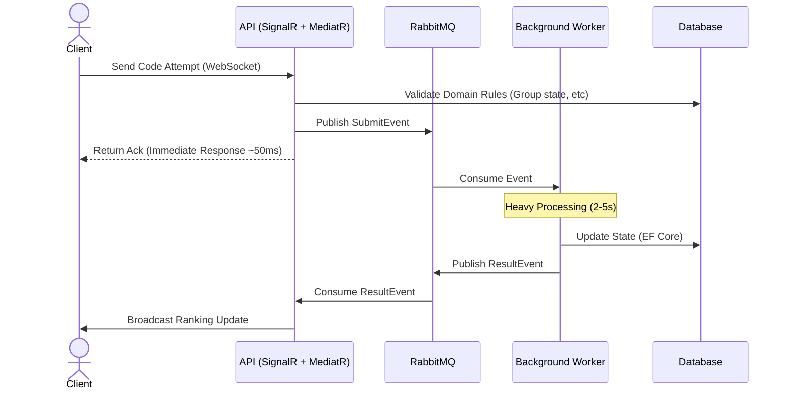

# 🦅 Falcon API Reborn 

[](https://dotnet.microsoft.com/)
[](docs/SIGNALR_RABBITMQ_ARCHITECTURE.md)
[](https://www.rabbitmq.com/)

**Falcon API Reborn** é uma reescrita arquitetural completa do backend do Falcon Competition. Afastando-se das camadas monolíticas tradicionais, este sistema foi reconstruído do zero utilizando **Clean Architecture**, **Domain-Driven Design (DDD)** e **Vertical Slice Architecture**. 

O projeto fornece uma infraestrutura distribuída e altamente resiliente para competições de programação em tempo real, apresentando avaliação assíncrona de código, broadcasting via WebSocket e validação estrita de domínio.

> 🔄 **A Evolução**: Esta é uma grande atualização de engenharia em relação à API legada original, focada em desacoplar regras de negócios de detalhes do framework e resolver gargalos de concorrência em tempo real.

---

## 🏗️ Evolução Arquitetural & ROI

Para entender o impacto de engenharia desta reescrita, aqui está a mudança de paradigma arquitetural:

| Aspecto | Arquitetura Legada | Arquitetura Reborn | Impacto na Engenharia |
|---------|----------------------|----------------|---------------------|
| **Core Design** | N-Tier Tradicional (Controllers → Services) | **Clean Architecture + DDD** | Regras de negócios são estritamente isoladas das dependências do framework. |
| **Organização** | Por preocupação técnica | **Vertical Slices** | Features são altamente coesas, tornando a base de código escalável entre múltiplas equipes. |
| **Mutação de Estado**| Chamadas diretas de Serviço | **CQRS via MediatR** | Separação estrita de operações de leitura/escrita, melhorando a manutenibilidade. |
| **Processamento** | `ConcurrentQueue` em memória | **RabbitMQ + MassTransit** | Resolveu vazamentos de memória e garantiu a entrega de mensagens sob alta carga. |
| **Tempo Real** | Polling | **SignalR WebSockets** | Reduziu a carga no banco de dados transmitindo mudanças de estado instantaneamente. |

---

## ⚙️ Principais Destaques de Engenharia

### 1. Domain-Driven Design (DDD) rigorosamente aplicado
A camada de domínio possui **zero dependências**. Todas as regras de negócios são aplicadas através de implementações de `IBusinessRule`, garantindo que entidades como `User`, `Group` e `Competition` estejam sempre em um estado válido. 

### 2. Processamento Distribuído (Pipeline de Mensageria)
Um grande desafio era evitar que a API bloqueasse enquanto serviços externos avaliavam o código submetido. 

**A Solução:**
* A API atua apenas como um gateway, enviando um `ISubmitExerciseCommand` para uma exchange do **RabbitMQ**.
* Um **Worker Service** independente e altamente escalável consome a fila, lida com o processamento pesado (integração com a Judge API) e atualiza o banco de dados.
* O Worker publica um evento `ISubmitExerciseResult`, que é capturado pela API e transmitido aos clientes via **SignalR**.


```mermaid
sequenceDiagram
    actor Client
    participant API as API (SignalR + MediatR)
    participant RMQ as RabbitMQ
    participant Worker as Background Worker
    participant DB as Database

    Client->>API: Send Code Attempt (WebSocket)
    API->>DB: Validate Domain Rules (Group state, etc)
    API->>RMQ: Publish SubmitEvent
    API-->>Client: Return Ack (Immediate Response ~50ms)
    
    RMQ->>Worker: Consume Event
    Note over Worker: Heavy Processing (2-5s)
    Worker->>DB: Update State (EF Core)
    Worker->>RMQ: Publish ResultEvent
    
    RMQ->>API: Consume ResultEvent
    API->>Client: Broadcast Ranking Update
```

### 3. Vertical Slice Architecture
Em vez de espalhar códigos relacionados por diferentes pastas técnicas, cada feature é completamente autocontida. Adicionar uma nova funcionalidade significa criar uma nova pasta, sem tocar nos arquivos centrais existentes.

```text
Features/
  Competitions/
    SubmitAttempt/
      SubmitAttemptCommand.cs      # CQRS Request
      SubmitAttemptHandler.cs      # Business Logic
      SubmitAttemptEndpoint.cs     # Minimal API Endpoint
```

---

## 🛠️ Visão Geral do Stack Tecnológico

* **Framework:** .NET 10, ASP.NET Core Minimal APIs
* **Arquitetura:** Clean Architecture, DDD, CQRS (MediatR), Vertical Slices
* **Dados & Persistência:** Entity Framework Core 10, SQL Server
* **Mensageria & Async:** RabbitMQ, MassTransit, Quartz.NET
* **Tempo Real:** SignalR
* **Qualidade:** xUnit, Moq (Abordagem TDD para lógica de Domínio)
* **DevOps:** Docker, Docker Compose, Preparado para Azure App Service

---

## 🚀 Primeiros Passos

Para rodar esta arquitetura localmente, certifique-se de ter o **Docker** e o **.NET 10 SDK** instalados.

1. **Clone o repositório e inicie a infraestrutura (RabbitMQ):**
   ```bash
   docker-compose up -d
   ```
2. **Aplique as Migrations do Banco de Dados:**
   ```bash
   ./update-db.sh  # ou .\update-db.ps1 no Windows
   ```
3. **Execute o Sistema Distribuído:**
   ```bash
   # Terminal 1 - The API Gateway
   dotnet run --project src/Falcon.Api

   # Terminal 2 - The Background Processor
   dotnet run --project src/Falcon.Worker
   ```

> 📖 **Documentação Completa da API:** Uma vez em execução, navegue para `https://localhost:7155/scalar/v1` para acessar a documentação interativa OpenAPI fornecida pelo Scalar.

---

## 📄 Licença
Este projeto está licenciado sob a Licença MIT - veja o arquivo [LICENSE.txt](LICENSE.txt) para detalhes.
