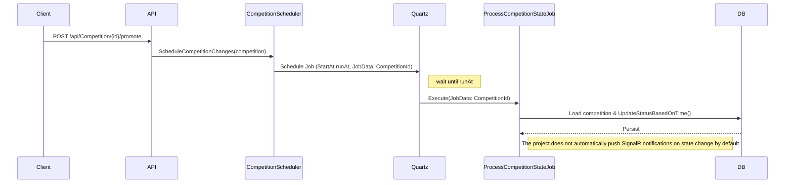

# Competition Scheduling (Quartz.NET)

This document describes how the project schedules automatic competition state updates using Quartz.NET and how to deploy it in production with persistence.

## Overview

- The API uses **Quartz.NET** to schedule jobs that update competition status at key dates (StartInscriptions, EndInscriptions, StartTime, EndTime).
- Jobs are scheduled when a template is promoted to an active competition (see `PromoteTemplateHandler`).
- The scheduling service is `CompetitionScheduler` and the job implementation is `ProcessCompetitionStateJob`.

## Scheduling Flow



## Job Details

- **Job type**: `ProcessCompetitionStateJob` (implements `Quartz.IJob`)
- **JobData**: `CompetitionId` (string/guid)
- **Group naming**: Jobs are created in a group named `Competition-{competitionId}`. Use `CompetitionScheduler.DeleteSchedule` to remove all jobs for a competition.
- **Trigger type**: One-shot `StartAt` triggers scheduled at the exact date/time.

## Current Implementation Notes

- The project registers Quartz via `AddQuartz();` and `AddQuartzHostedService(...)` in `Program.cs`.
- By default Quartz uses an in-memory scheduler (non-persistent). If the API restarts, scheduled one-shot triggers are lost.

**Note about configuration:** The API supports an opt-in persistent configuration via `appsettings` keys `Quartz:UsePersistentStore` (bool) and `Quartz:UseClustering` (bool). When `UsePersistentStore` is set to `true` the programmatic setup in `Program.cs` configures the `AdoJobStore` using the application's `DefaultConnection`.


## Production Recommendations

1. **Use AdoJobStore (SQL Server)** to persist scheduled jobs and triggers so they survive restarts.
2. **Enable clustering** when running multiple instances to avoid duplicate executions and to provide failover.
3. **Run Quartz table creation scripts** for SQL Server (available in the Quartz distribution).
4. **Add observability**: log job start/finish/failure with CompetitionId and capture metrics for job duration/failures.

### Programmatic example (recommended)

```csharp
// In Program.cs
builder.Services.AddQuartz(q =>
{
    q.UseMicrosoftDependencyInjectionJobFactory();
    q.SchedulerId = "AUTO"; // or custom id
    q.UsePersistentStore(s =>
    {
        s.UseSqlServer(sqlServer =>
        {
            // Use the same connection as the app's DefaultConnection
            sqlServer.ConnectionString = builder.Configuration.GetConnectionString("DefaultConnection");
        });
        s.UseClustering();
    });
});

builder.Services.AddQuartzHostedService(q => q.WaitForJobsToComplete = true);
```

### appsettings (example YAML)

```yaml
quartz:
  scheduler:
    instanceName: "FalconScheduler"
    instanceId: "AUTO"
  jobStore:
    type: "Quartz.Impl.AdoJobStore.JobStoreTX, Quartz"
    useProperties: true
    dataSource: "default"
    tablePrefix: "QRTZ_"
    driverDelegateType: "Quartz.Impl.AdoJobStore.SqlServerDelegate, Quartz"
  dataSource:
    default:
      provider: "SqlServer"
      connectionString: "Server=localhost,1433;Database=falcon-reborn;User ID=sa;Password=YourPassword;"
```

## Database setup

- Quartz ships with SQL scripts to create the required tables (look for `quartz_tables_sqlServer.sql` in the Quartz distribution). Run these scripts against your SQL Server instance prior to enabling AdoJobStore.

## Testing and Validation

- Add integration tests that promote a template and assert that jobs were created in the scheduler (query `IScheduler.GetJobKeys(GroupMatcher<JobKey>.GroupEquals("Competition-{id}"))`).
- Optionally add end-to-end tests that configure Quartz with AdoJobStore against a test SQL Server and verify persistence across restarts.

## Observability

- Log job executions with `ILogger` including `CompetitionId` and job name.
- Expose metrics (e.g., job duration, failure count) via your monitoring stack (Prometheus, Application Insights, etc.).

---

This document is part of the TCC documentation set and should be referenced in `README` files and architecture docs.
